# [📈 Live Status](https://GiuseppeFilingeri.github.io/upgraded-symmetrical-waddle): <!--live status--> **🟧 Partial outage**

With [Upptime](https://upptime.js.org), you can get your own unlimited and free uptime monitor and status page, powered entirely by a GitHub repository. We use [Issues](https://github.com/GiuseppeFilingeri/upgraded-symmetrical-waddle/issues) as incident reports, [Actions](https://github.com/GiuseppeFilingeri/upgraded-symmetrical-waddle/actions) as uptime monitors, and [Pages](https://GiuseppeFilingeri.github.io/upgraded-symmetrical-waddle) for the status page.

<!--start: status pages-->
<!-- This summary is generated by Upptime (https://github.com/upptime/upptime) -->
<!-- Do not edit this manually, your changes will be overwritten -->
<!-- prettier-ignore -->
| URL | Status | History | Response Time | Uptime |
| --- | ------ | ------- | ------------- | ------ |
|  [Google](https://www.google.com) | 🟩 Up | [google.yml](https://github.com/GiuseppeFilingeri/upgraded-symmetrical-waddle/commits/HEAD/history/google.yml) | 

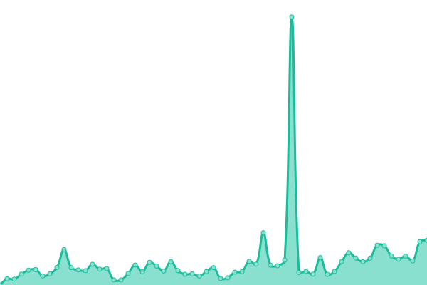 204ms
     
 | 

<a href="https://GiuseppeFilingeri.github.io/upgraded-symmetrical-waddle/history/google">100.00%</a>
    

|  [Wikipedia](https://en.wikipedia.org) | 🟩 Up | [wikipedia.yml](https://github.com/GiuseppeFilingeri/upgraded-symmetrical-waddle/commits/HEAD/history/wikipedia.yml) | 

 308ms
     
 | 

<a href="https://GiuseppeFilingeri.github.io/upgraded-symmetrical-waddle/history/wikipedia">100.00%</a>
    

|  [Disdicilo](https://www.disdicilo.it) | 🟥 Down | [disdicilo.yml](https://github.com/GiuseppeFilingeri/upgraded-symmetrical-waddle/commits/HEAD/history/disdicilo.yml) | 

 1056ms
     
 | 

<a href="https://GiuseppeFilingeri.github.io/upgraded-symmetrical-waddle/history/disdicilo">96.46%</a>
    

|  [Mangahype](https://www.mangahype.org) | 🟥 Down | [mangahype.yml](https://github.com/GiuseppeFilingeri/upgraded-symmetrical-waddle/commits/HEAD/history/mangahype.yml) | 

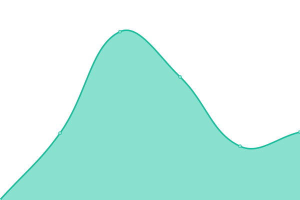 0ms
     
 | 

<a href="https://GiuseppeFilingeri.github.io/upgraded-symmetrical-waddle/history/mangahype">0.00%</a>
    

|  [DuckDuckGo](https://duckduckgo.com) | 🟩 Up | [duck-duck-go.yml](https://github.com/GiuseppeFilingeri/upgraded-symmetrical-waddle/commits/HEAD/history/duck-duck-go.yml) | 

 174ms
     
 | 

<a href="https://GiuseppeFilingeri.github.io/upgraded-symmetrical-waddle/history/duck-duck-go">100.00%</a>
    

|  [symmetrical waddle](https://giuseppefilingeri.github.io/upgraded-symmetrical-waddle) | 🟩 Up | [symmetrical-waddle.yml](https://github.com/GiuseppeFilingeri/upgraded-symmetrical-waddle/commits/HEAD/history/symmetrical-waddle.yml) | 

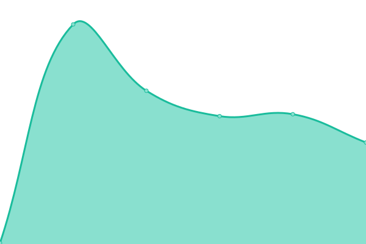 109ms
     
 | 

<a href="https://GiuseppeFilingeri.github.io/upgraded-symmetrical-waddle/history/symmetrical-waddle">100.00%</a>
    

|  [ziggys-bar](ziggys-bar.com) | 🟥 Down | [ziggys-bar.yml](https://github.com/GiuseppeFilingeri/upgraded-symmetrical-waddle/commits/HEAD/history/ziggys-bar.yml) | 

 0ms
     
 | 

<a href="https://GiuseppeFilingeri.github.io/upgraded-symmetrical-waddle/history/ziggys-bar">100.00%</a>
    

|  [nedis](nedis.nl) | 🟩 Up | [nedis.yml](https://github.com/GiuseppeFilingeri/upgraded-symmetrical-waddle/commits/HEAD/history/nedis.yml) | 

 2032ms
     
 | 

<a href="https://GiuseppeFilingeri.github.io/upgraded-symmetrical-waddle/history/nedis">52.94%</a>
    

|  [websearch](websearch.com) | 🟥 Down | [websearch.yml](https://github.com/GiuseppeFilingeri/upgraded-symmetrical-waddle/commits/HEAD/history/websearch.yml) | 

 0ms
     
 | 

<a href="https://GiuseppeFilingeri.github.io/upgraded-symmetrical-waddle/history/websearch">0.00%</a>
    

|  [iranrapfa](iranrapfa.com) | 🟥 Down | [iranrapfa.yml](https://github.com/GiuseppeFilingeri/upgraded-symmetrical-waddle/commits/HEAD/history/iranrapfa.yml) | 

 0ms
     
 | 

<a href="https://GiuseppeFilingeri.github.io/upgraded-symmetrical-waddle/history/iranrapfa">100.00%</a>
    

|  [allekabels](allekabels.nl) | 🟥 Down | [allekabels.yml](https://github.com/GiuseppeFilingeri/upgraded-symmetrical-waddle/commits/HEAD/history/allekabels.yml) | 

 333ms
     
 | 

<a href="https://GiuseppeFilingeri.github.io/upgraded-symmetrical-waddle/history/allekabels">0.00%</a>
    

|  [kabeltje](kabeltje.com) | 🟥 Down | [kabeltje.yml](https://github.com/GiuseppeFilingeri/upgraded-symmetrical-waddle/commits/HEAD/history/kabeltje.yml) | 

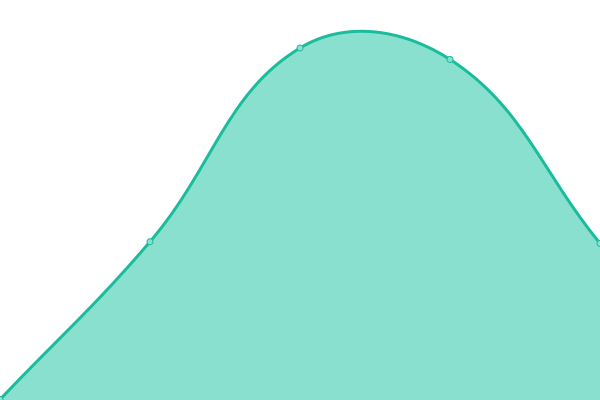 420ms
     
 | 

<a href="https://GiuseppeFilingeri.github.io/upgraded-symmetrical-waddle/history/kabeltje">0.00%</a>
    

|  [cocinasana](cocinasana.net) | 🟩 Up | [cocinasana.yml](https://github.com/GiuseppeFilingeri/upgraded-symmetrical-waddle/commits/HEAD/history/cocinasana.yml) | 

 201ms
     
 | 

<a href="https://GiuseppeFilingeri.github.io/upgraded-symmetrical-waddle/history/cocinasana">100.00%</a>
    

|  [bitfan](bitfan.com) | 🟥 Down | [bitfan.yml](https://github.com/GiuseppeFilingeri/upgraded-symmetrical-waddle/commits/HEAD/history/bitfan.yml) | 

 0ms
     
 | 

<a href="https://GiuseppeFilingeri.github.io/upgraded-symmetrical-waddle/history/bitfan">0.00%</a>
    

|  [xxlhd](xxlhd.com) | 🟩 Up | [xxlhd.yml](https://github.com/GiuseppeFilingeri/upgraded-symmetrical-waddle/commits/HEAD/history/xxlhd.yml) | 

 99ms
     
 | 

<a href="https://GiuseppeFilingeri.github.io/upgraded-symmetrical-waddle/history/xxlhd">78.79%</a>
    

|  [megachicks](megachicks.ru) | 🟥 Down | [megachicks.yml](https://github.com/GiuseppeFilingeri/upgraded-symmetrical-waddle/commits/HEAD/history/megachicks.yml) | 

 0ms
     
 | 

<a href="https://GiuseppeFilingeri.github.io/upgraded-symmetrical-waddle/history/megachicks">100.00%</a>
    

|  [riphone](riphone.ru) | 🟥 Down | [riphone.yml](https://github.com/GiuseppeFilingeri/upgraded-symmetrical-waddle/commits/HEAD/history/riphone.yml) | 

 0ms
     
 | 

<a href="https://GiuseppeFilingeri.github.io/upgraded-symmetrical-waddle/history/riphone">100.00%</a>
    

|  [riphone](riphone.ru) | 🟥 Down | [riphone.yml](https://github.com/GiuseppeFilingeri/upgraded-symmetrical-waddle/commits/HEAD/history/riphone.yml) | 

 0ms
     
 | 

<a href="https://GiuseppeFilingeri.github.io/upgraded-symmetrical-waddle/history/riphone">100.00%</a>
    

|  [twoc](twoc.co.uk) | 🟩 Up | [twoc.yml](https://github.com/GiuseppeFilingeri/upgraded-symmetrical-waddle/commits/HEAD/history/twoc.yml) | 

 283ms
     
 | 

<a href="https://GiuseppeFilingeri.github.io/upgraded-symmetrical-waddle/history/twoc">62.91%</a>
    

|  [btinternet](btinternet.com) | 🟥 Down | [btinternet.yml](https://github.com/GiuseppeFilingeri/upgraded-symmetrical-waddle/commits/HEAD/history/btinternet.yml) | 

 0ms
     
 | 

<a href="https://GiuseppeFilingeri.github.io/upgraded-symmetrical-waddle/history/btinternet">100.00%</a>
    

|  [cryo-save](cryo-save.com) | 🟥 Down | [cryo-save.yml](https://github.com/GiuseppeFilingeri/upgraded-symmetrical-waddle/commits/HEAD/history/cryo-save.yml) | 

 0ms
     
 | 

<a href="https://GiuseppeFilingeri.github.io/upgraded-symmetrical-waddle/history/cryo-save">0.00%</a>
    

|  [funniegames](funniegames.nl) | 🟩 Up | [funniegames.yml](https://github.com/GiuseppeFilingeri/upgraded-symmetrical-waddle/commits/HEAD/history/funniegames.yml) | 

 845ms
     
 | 

<a href="https://GiuseppeFilingeri.github.io/upgraded-symmetrical-waddle/history/funniegames">0.00%</a>
    

|  [hcr](hcr.co.uk) | 🟩 Up | [hcr.yml](https://github.com/GiuseppeFilingeri/upgraded-symmetrical-waddle/commits/HEAD/history/hcr.yml) | 

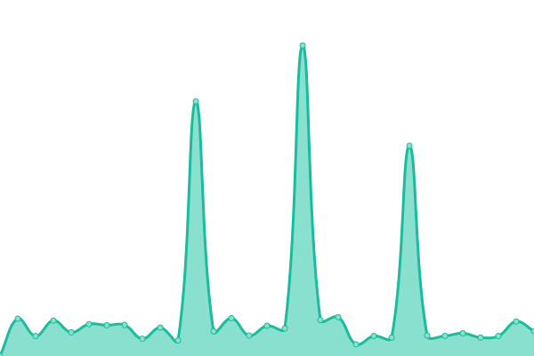 2041ms
     
 | 

<a href="https://GiuseppeFilingeri.github.io/upgraded-symmetrical-waddle/history/hcr">99.79%</a>
    

|  [hcr](hcr.com) | 🟩 Up | [hcr.yml](https://github.com/GiuseppeFilingeri/upgraded-symmetrical-waddle/commits/HEAD/history/hcr.yml) | 

 2041ms
     
 | 

<a href="https://GiuseppeFilingeri.github.io/upgraded-symmetrical-waddle/history/hcr">99.79%</a>
    

|  [kazeebo](kazeebo.com) | 🟥 Down | [kazeebo.yml](https://github.com/GiuseppeFilingeri/upgraded-symmetrical-waddle/commits/HEAD/history/kazeebo.yml) | 

 0ms
     
 | 

<a href="https://GiuseppeFilingeri.github.io/upgraded-symmetrical-waddle/history/kazeebo">100.00%</a>
    

|  [bluewin](bluewin.com) | 🟥 Down | [bluewin.yml](https://github.com/GiuseppeFilingeri/upgraded-symmetrical-waddle/commits/HEAD/history/bluewin.yml) | 

 0ms
     
 | 

<a href="https://GiuseppeFilingeri.github.io/upgraded-symmetrical-waddle/history/bluewin">0.00%</a>
    

|  [emilcohen](emilcohen.com) | 🟩 Up | [emilcohen.yml](https://github.com/GiuseppeFilingeri/upgraded-symmetrical-waddle/commits/HEAD/history/emilcohen.yml) | 

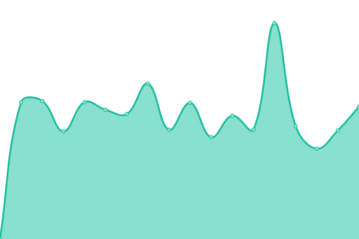 519ms
     
 | 

<a href="https://GiuseppeFilingeri.github.io/upgraded-symmetrical-waddle/history/emilcohen">100.00%</a>
    

|  [freeusweb](freeusweb.com) | 🟥 Down | [freeusweb.yml](https://github.com/GiuseppeFilingeri/upgraded-symmetrical-waddle/commits/HEAD/history/freeusweb.yml) | 

 0ms
     
 | 

<a href="https://GiuseppeFilingeri.github.io/upgraded-symmetrical-waddle/history/freeusweb">100.00%</a>
    

|  [urbanlime](urbanlime.com) | 🟩 Up | [urbanlime.yml](https://github.com/GiuseppeFilingeri/upgraded-symmetrical-waddle/commits/HEAD/history/urbanlime.yml) | 

 719ms
     
 | 

<a href="https://GiuseppeFilingeri.github.io/upgraded-symmetrical-waddle/history/urbanlime">100.00%</a>
    

|  [smartcine](smartcine.com) | 🟩 Up | [smartcine.yml](https://github.com/GiuseppeFilingeri/upgraded-symmetrical-waddle/commits/HEAD/history/smartcine.yml) | 

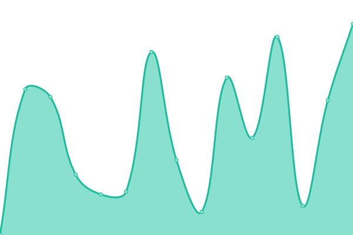 246ms
     
 | 

<a href="https://GiuseppeFilingeri.github.io/upgraded-symmetrical-waddle/history/smartcine">100.00%</a>
    

|  [bizline](bizline.com.pk) | 🟩 Up | [bizline.yml](https://github.com/GiuseppeFilingeri/upgraded-symmetrical-waddle/commits/HEAD/history/bizline.yml) | 

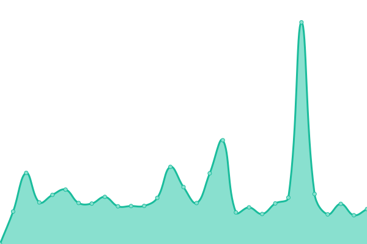 3388ms
     
 | 

<a href="https://GiuseppeFilingeri.github.io/upgraded-symmetrical-waddle/history/bizline">19.97%</a>
    

|  [alkon](alkon.com.ar) | 🟩 Up | [alkon.yml](https://github.com/GiuseppeFilingeri/upgraded-symmetrical-waddle/commits/HEAD/history/alkon.yml) | 

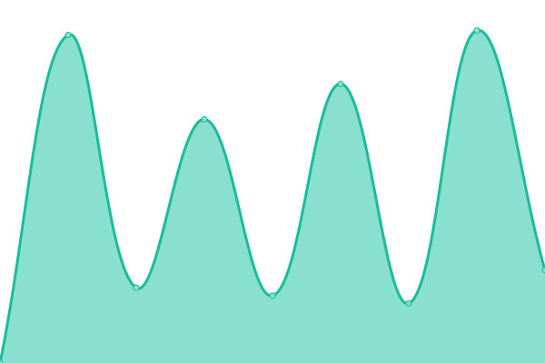 2751ms
     
 | 

<a href="https://GiuseppeFilingeri.github.io/upgraded-symmetrical-waddle/history/alkon">100.00%</a>
    

|  [alkon](alkon.com.ar) | 🟩 Up | [alkon.yml](https://github.com/GiuseppeFilingeri/upgraded-symmetrical-waddle/commits/HEAD/history/alkon.yml) | 

 2751ms
     
 | 

<a href="https://GiuseppeFilingeri.github.io/upgraded-symmetrical-waddle/history/alkon">100.00%</a>
    

|  [inkmizer](inkmizer.com) | 🟩 Up | [inkmizer.yml](https://github.com/GiuseppeFilingeri/upgraded-symmetrical-waddle/commits/HEAD/history/inkmizer.yml) | 

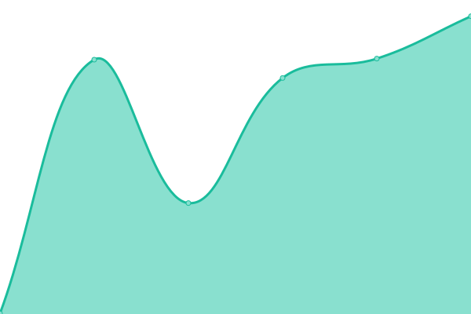 340ms
     
 | 

<a href="https://GiuseppeFilingeri.github.io/upgraded-symmetrical-waddle/history/inkmizer">100.00%</a>
    

|  [inkcityusa](inkcityusa.com) | 🟥 Down | [inkcityusa.yml](https://github.com/GiuseppeFilingeri/upgraded-symmetrical-waddle/commits/HEAD/history/inkcityusa.yml) | 

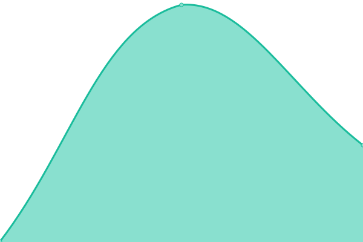 0ms
     
 | 

<a href="https://GiuseppeFilingeri.github.io/upgraded-symmetrical-waddle/history/inkcityusa">0.00%</a>
    

|  [inkcityusa](inkcityusa.com) | 🟥 Down | [inkcityusa.yml](https://github.com/GiuseppeFilingeri/upgraded-symmetrical-waddle/commits/HEAD/history/inkcityusa.yml) | 

 0ms
     
 | 

<a href="https://GiuseppeFilingeri.github.io/upgraded-symmetrical-waddle/history/inkcityusa">0.00%</a>
    

|  [ajexa](ajexa.com) | 🟥 Down | [ajexa.yml](https://github.com/GiuseppeFilingeri/upgraded-symmetrical-waddle/commits/HEAD/history/ajexa.yml) | 

 836ms
     
 | 

<a href="https://GiuseppeFilingeri.github.io/upgraded-symmetrical-waddle/history/ajexa">100.00%</a>
    

|  [everbesthk](everbesthk.com) | 🟥 Down | [everbesthk.yml](https://github.com/GiuseppeFilingeri/upgraded-symmetrical-waddle/commits/HEAD/history/everbesthk.yml) | 

 0ms
     
 | 

<a href="https://GiuseppeFilingeri.github.io/upgraded-symmetrical-waddle/history/everbesthk">100.00%</a>
    

|  [hongkong](hongkong.com) | 🟩 Up | [hongkong.yml](https://github.com/GiuseppeFilingeri/upgraded-symmetrical-waddle/commits/HEAD/history/hongkong.yml) | 

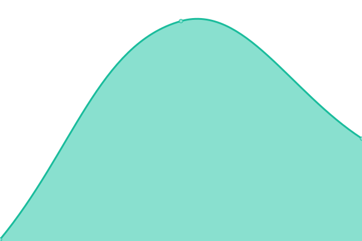 165ms
     
 | 

<a href="https://GiuseppeFilingeri.github.io/upgraded-symmetrical-waddle/history/hongkong">0.00%</a>
    

|  [hket](hket.com) | 🟥 Down | [hket.yml](https://github.com/GiuseppeFilingeri/upgraded-symmetrical-waddle/commits/HEAD/history/hket.yml) | 

 631ms
     
 | 

<a href="https://GiuseppeFilingeri.github.io/upgraded-symmetrical-waddle/history/hket">86.06%</a>
    

|  [raoiit](raoiit.com) | 🟥 Down | [raoiit.yml](https://github.com/GiuseppeFilingeri/upgraded-symmetrical-waddle/commits/HEAD/history/raoiit.yml) | 

 0ms
     
 | 

<a href="https://GiuseppeFilingeri.github.io/upgraded-symmetrical-waddle/history/raoiit">0.00%</a>
    

|  [citybuild](citybuild.bg) | 🟩 Up | [citybuild.yml](https://github.com/GiuseppeFilingeri/upgraded-symmetrical-waddle/commits/HEAD/history/citybuild.yml) | 

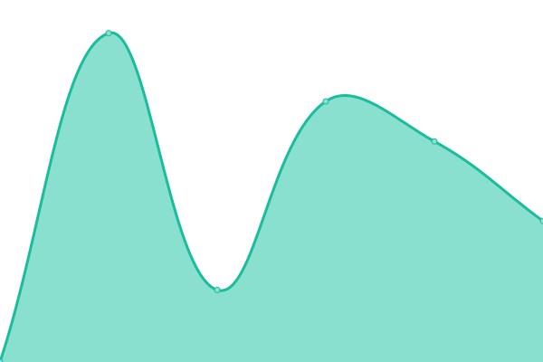 2387ms
     
 | 

<a href="https://GiuseppeFilingeri.github.io/upgraded-symmetrical-waddle/history/citybuild">100.00%</a>
    

|  [phun](phun.org) | 🟥 Down | [phun.yml](https://github.com/GiuseppeFilingeri/upgraded-symmetrical-waddle/commits/HEAD/history/phun.yml) | 

 225ms
     
 | 

<a href="https://GiuseppeFilingeri.github.io/upgraded-symmetrical-waddle/history/phun">0.00%</a>
    

|  [anyoption](anyoption.com) | 🟩 Up | [anyoption.yml](https://github.com/GiuseppeFilingeri/upgraded-symmetrical-waddle/commits/HEAD/history/anyoption.yml) | 

 391ms
     
 | 

<a href="https://GiuseppeFilingeri.github.io/upgraded-symmetrical-waddle/history/anyoption">87.31%</a>
    

|  [anyoption](anyoption.com) | 🟩 Up | [anyoption.yml](https://github.com/GiuseppeFilingeri/upgraded-symmetrical-waddle/commits/HEAD/history/anyoption.yml) | 

 391ms
     
 | 

<a href="https://GiuseppeFilingeri.github.io/upgraded-symmetrical-waddle/history/anyoption">87.31%</a>
    

|  [powerballs](powerballs.si) | 🟥 Down | [powerballs.yml](https://github.com/GiuseppeFilingeri/upgraded-symmetrical-waddle/commits/HEAD/history/powerballs.yml) | 

 0ms
     
 | 

<a href="https://GiuseppeFilingeri.github.io/upgraded-symmetrical-waddle/history/powerballs">100.00%</a>
    

|  [finechance](finechance.com) | 🟩 Up | [finechance.yml](https://github.com/GiuseppeFilingeri/upgraded-symmetrical-waddle/commits/HEAD/history/finechance.yml) | 

 247ms
     
 | 

<a href="https://GiuseppeFilingeri.github.io/upgraded-symmetrical-waddle/history/finechance">100.00%</a>
    

|  [saunta](saunta.com) | 🟩 Up | [saunta.yml](https://github.com/GiuseppeFilingeri/upgraded-symmetrical-waddle/commits/HEAD/history/saunta.yml) | 

 370ms
     
 | 

<a href="https://GiuseppeFilingeri.github.io/upgraded-symmetrical-waddle/history/saunta">78.76%</a>
    

|  [javgals](javgals.com) | 🟥 Down | [javgals.yml](https://github.com/GiuseppeFilingeri/upgraded-symmetrical-waddle/commits/HEAD/history/javgals.yml) | 

 0ms
     
 | 

<a href="https://GiuseppeFilingeri.github.io/upgraded-symmetrical-waddle/history/javgals">0.00%</a>
    

|  [avflix](avflix.tv) | 🟥 Down | [avflix.yml](https://github.com/GiuseppeFilingeri/upgraded-symmetrical-waddle/commits/HEAD/history/avflix.yml) | 

 0ms
     
 | 

<a href="https://GiuseppeFilingeri.github.io/upgraded-symmetrical-waddle/history/avflix">100.00%</a>
    

|  [pspadik](pspadik.com) | 🟥 Down | [pspadik.yml](https://github.com/GiuseppeFilingeri/upgraded-symmetrical-waddle/commits/HEAD/history/pspadik.yml) | 

 0ms
     
 | 

<a href="https://GiuseppeFilingeri.github.io/upgraded-symmetrical-waddle/history/pspadik">100.00%</a>
    

|  [pspadik](pspadik.com) | 🟥 Down | [pspadik.yml](https://github.com/GiuseppeFilingeri/upgraded-symmetrical-waddle/commits/HEAD/history/pspadik.yml) | 

 0ms
     
 | 

<a href="https://GiuseppeFilingeri.github.io/upgraded-symmetrical-waddle/history/pspadik">100.00%</a>
    

|  [mcafee](mcafee.com) | 🟩 Up | [mcafee.yml](https://github.com/GiuseppeFilingeri/upgraded-symmetrical-waddle/commits/HEAD/history/mcafee.yml) | 

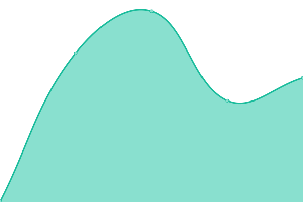 800ms
     
 | 

<a href="https://GiuseppeFilingeri.github.io/upgraded-symmetrical-waddle/history/mcafee">100.00%</a>
    

|  [happyd](happyd.cn) | 🟥 Down | [happyd.yml](https://github.com/GiuseppeFilingeri/upgraded-symmetrical-waddle/commits/HEAD/history/happyd.yml) | 

 553ms
     
 | 

<a href="https://GiuseppeFilingeri.github.io/upgraded-symmetrical-waddle/history/happyd">0.00%</a>
    

|  [da100](da100.com) | 🟥 Down | [da100.yml](https://github.com/GiuseppeFilingeri/upgraded-symmetrical-waddle/commits/HEAD/history/da100.yml) | 

 0ms
     
 | 

<a href="https://GiuseppeFilingeri.github.io/upgraded-symmetrical-waddle/history/da100">100.00%</a>
    

|  [da1234](da1234.cn) | 🟩 Up | [da1234.yml](https://github.com/GiuseppeFilingeri/upgraded-symmetrical-waddle/commits/HEAD/history/da1234.yml) | 

 1590ms
     
 | 

<a href="https://GiuseppeFilingeri.github.io/upgraded-symmetrical-waddle/history/da1234">99.82%</a>
    

|  [irip](irip.com) | 🟩 Up | [irip.yml](https://github.com/GiuseppeFilingeri/upgraded-symmetrical-waddle/commits/HEAD/history/irip.yml) | 

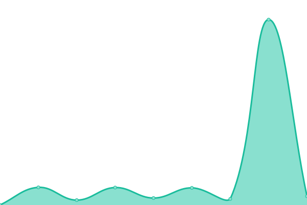 367ms
     
 | 

<a href="https://GiuseppeFilingeri.github.io/upgraded-symmetrical-waddle/history/irip">100.00%</a>
    

|  [irip](irip.com) | 🟩 Up | [irip.yml](https://github.com/GiuseppeFilingeri/upgraded-symmetrical-waddle/commits/HEAD/history/irip.yml) | 

 367ms
     
 | 

<a href="https://GiuseppeFilingeri.github.io/upgraded-symmetrical-waddle/history/irip">100.00%</a>
    

|  [wvtaxsales](wvtaxsales.com) | 🟥 Down | [wvtaxsales.yml](https://github.com/GiuseppeFilingeri/upgraded-symmetrical-waddle/commits/HEAD/history/wvtaxsales.yml) | 

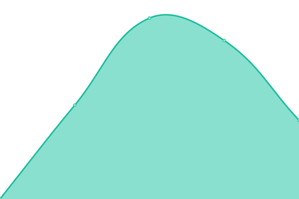 463ms
     
 | 

<a href="https://GiuseppeFilingeri.github.io/upgraded-symmetrical-waddle/history/wvtaxsales">0.00%</a>
    

|  [omegawow](omegawow.com) | 🟥 Down | [omegawow.yml](https://github.com/GiuseppeFilingeri/upgraded-symmetrical-waddle/commits/HEAD/history/omegawow.yml) | 

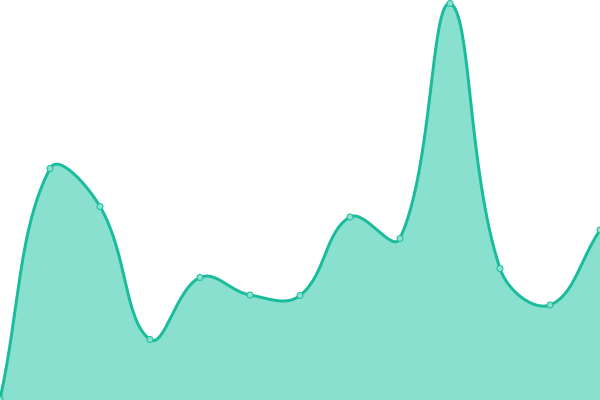 167ms
     
 | 

<a href="https://GiuseppeFilingeri.github.io/upgraded-symmetrical-waddle/history/omegawow">0.00%</a>
    

|  [o2o1](o2o1.com) | 🟩 Up | [o2o1.yml](https://github.com/GiuseppeFilingeri/upgraded-symmetrical-waddle/commits/HEAD/history/o2o1.yml) | 

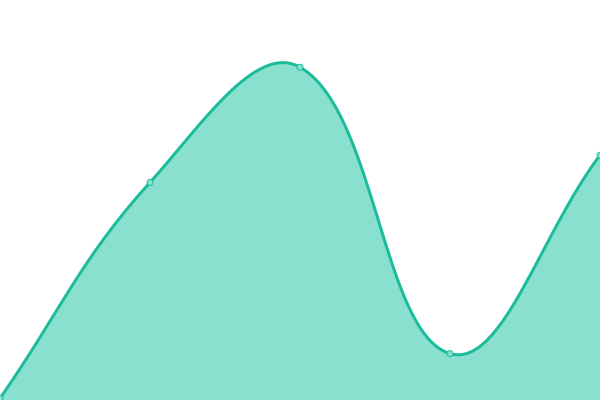 154ms
     
 | 

<a href="https://GiuseppeFilingeri.github.io/upgraded-symmetrical-waddle/history/o2o1">76.28%</a>
    

|  [komets](komets.com) | 🟩 Up | [komets.yml](https://github.com/GiuseppeFilingeri/upgraded-symmetrical-waddle/commits/HEAD/history/komets.yml) | 

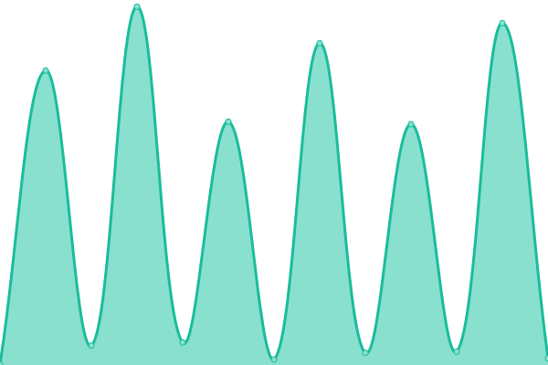 287ms
     
 | 

<a href="https://GiuseppeFilingeri.github.io/upgraded-symmetrical-waddle/history/komets">95.33%</a>
    

|  [komets](komets.com) | 🟩 Up | [komets.yml](https://github.com/GiuseppeFilingeri/upgraded-symmetrical-waddle/commits/HEAD/history/komets.yml) | 

 287ms
     
 | 

<a href="https://GiuseppeFilingeri.github.io/upgraded-symmetrical-waddle/history/komets">95.33%</a>
    

|  [wwwfox](wwwfox.com) | 🟩 Up | [wwwfox.yml](https://github.com/GiuseppeFilingeri/upgraded-symmetrical-waddle/commits/HEAD/history/wwwfox.yml) | 

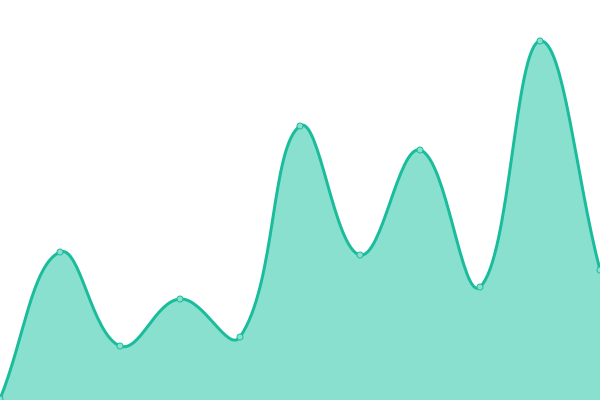 414ms
     
 | 

<a href="https://GiuseppeFilingeri.github.io/upgraded-symmetrical-waddle/history/wwwfox">19.24%</a>
    

|  [wwwfox](wwwfox.com) | 🟩 Up | [wwwfox.yml](https://github.com/GiuseppeFilingeri/upgraded-symmetrical-waddle/commits/HEAD/history/wwwfox.yml) | 

 414ms
     
 | 

<a href="https://GiuseppeFilingeri.github.io/upgraded-symmetrical-waddle/history/wwwfox">19.24%</a>
    

|  [kiwiindian](kiwiindian.com) | 🟩 Up | [kiwiindian.yml](https://github.com/GiuseppeFilingeri/upgraded-symmetrical-waddle/commits/HEAD/history/kiwiindian.yml) | 

 295ms
     
 | 

<a href="https://GiuseppeFilingeri.github.io/upgraded-symmetrical-waddle/history/kiwiindian">100.00%</a>
    

|  [youtube](youtube.com) | 🟩 Up | [youtube.yml](https://github.com/GiuseppeFilingeri/upgraded-symmetrical-waddle/commits/HEAD/history/youtube.yml) | 

 358ms
     
 | 

<a href="https://GiuseppeFilingeri.github.io/upgraded-symmetrical-waddle/history/youtube">100.00%</a>
    

|  [porsche](porsche.com) | 🟩 Up | [porsche.yml](https://github.com/GiuseppeFilingeri/upgraded-symmetrical-waddle/commits/HEAD/history/porsche.yml) | 

 626ms
     
 | 

<a href="https://GiuseppeFilingeri.github.io/upgraded-symmetrical-waddle/history/porsche">0.00%</a>
    

|  [rivet](rivet.com) | 🟩 Up | [rivet.yml](https://github.com/GiuseppeFilingeri/upgraded-symmetrical-waddle/commits/HEAD/history/rivet.yml) | 

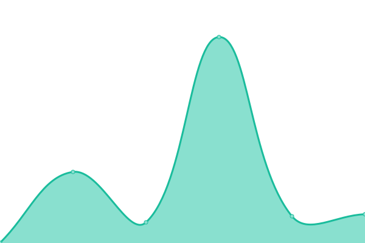 200ms
     
 | 

<a href="https://GiuseppeFilingeri.github.io/upgraded-symmetrical-waddle/history/rivet">86.90%</a>
    

|  [wipro](wipro.com) | 🟩 Up | [wipro.yml](https://github.com/GiuseppeFilingeri/upgraded-symmetrical-waddle/commits/HEAD/history/wipro.yml) | 

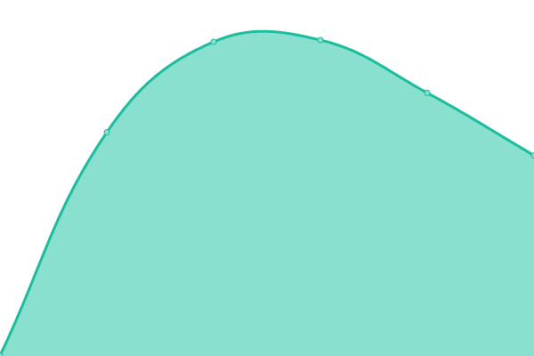 859ms
     
 | 

<a href="https://GiuseppeFilingeri.github.io/upgraded-symmetrical-waddle/history/wipro">100.00%</a>
    

|  [otzar](otzar.biz) | 🟥 Down | [otzar.yml](https://github.com/GiuseppeFilingeri/upgraded-symmetrical-waddle/commits/HEAD/history/otzar.yml) | 

 0ms
     
 | 

<a href="https://GiuseppeFilingeri.github.io/upgraded-symmetrical-waddle/history/otzar">0.00%</a>
    

|  [oracle](oracle.com) | 🟥 Down | [oracle.yml](https://github.com/GiuseppeFilingeri/upgraded-symmetrical-waddle/commits/HEAD/history/oracle.yml) | 

 462ms
     
 | 

<a href="https://GiuseppeFilingeri.github.io/upgraded-symmetrical-waddle/history/oracle">0.00%</a>
    

|  [mynewsize](mynewsize.com) | 🟩 Up | [mynewsize.yml](https://github.com/GiuseppeFilingeri/upgraded-symmetrical-waddle/commits/HEAD/history/mynewsize.yml) | 

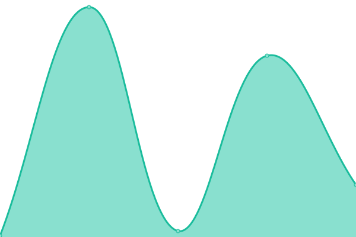 987ms
     
 | 

<a href="https://GiuseppeFilingeri.github.io/upgraded-symmetrical-waddle/history/mynewsize">99.73%</a>
    

|  [mynewsize](mynewsize.com) | 🟩 Up | [mynewsize.yml](https://github.com/GiuseppeFilingeri/upgraded-symmetrical-waddle/commits/HEAD/history/mynewsize.yml) | 

 987ms
     
 | 

<a href="https://GiuseppeFilingeri.github.io/upgraded-symmetrical-waddle/history/mynewsize">99.73%</a>
    

|  [coverups](coverups.com) | 🟩 Up | [coverups.yml](https://github.com/GiuseppeFilingeri/upgraded-symmetrical-waddle/commits/HEAD/history/coverups.yml) | 

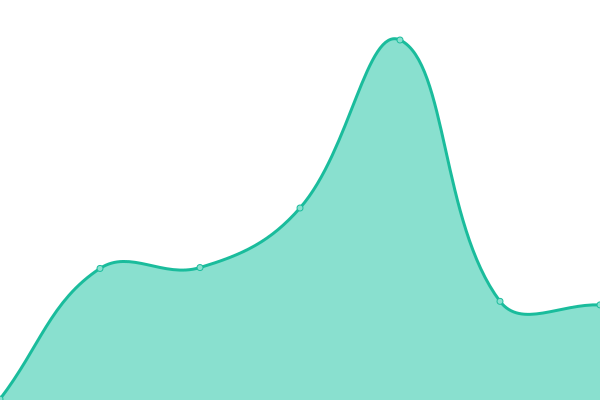 194ms
     
 | 

<a href="https://GiuseppeFilingeri.github.io/upgraded-symmetrical-waddle/history/coverups">99.70%</a>
    

|  [act](act.uk.com) | 🟥 Down | [act.yml](https://github.com/GiuseppeFilingeri/upgraded-symmetrical-waddle/commits/HEAD/history/act.yml) | 

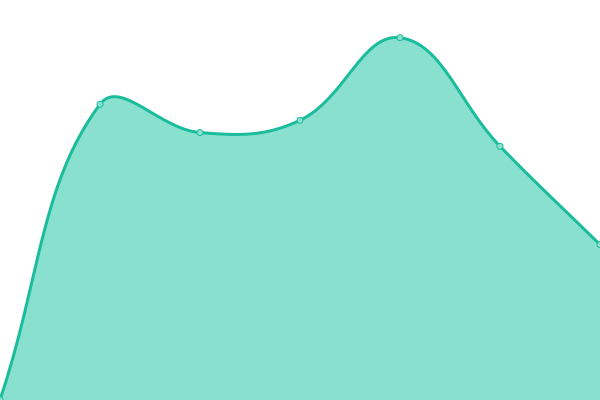 0ms
     
 | 

<a href="https://GiuseppeFilingeri.github.io/upgraded-symmetrical-waddle/history/act">100.00%</a>
    

|  [timetotrade](timetotrade.eu) | 🟩 Up | [timetotrade.yml](https://github.com/GiuseppeFilingeri/upgraded-symmetrical-waddle/commits/HEAD/history/timetotrade.yml) | 

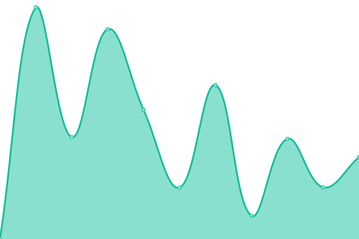 393ms
     
 | 

<a href="https://GiuseppeFilingeri.github.io/upgraded-symmetrical-waddle/history/timetotrade">99.96%</a>
    

|  [alexkale](alexkale.co.uk) | 🟥 Down | [alexkale.yml](https://github.com/GiuseppeFilingeri/upgraded-symmetrical-waddle/commits/HEAD/history/alexkale.yml) | 

 0ms
     
 | 

<a href="https://GiuseppeFilingeri.github.io/upgraded-symmetrical-waddle/history/alexkale">100.00%</a>
    

|  [nolast](nolast.com) | 🟩 Up | [nolast.yml](https://github.com/GiuseppeFilingeri/upgraded-symmetrical-waddle/commits/HEAD/history/nolast.yml) | 

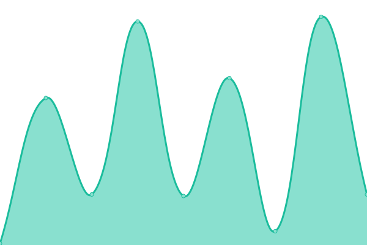 367ms
     
 | 

<a href="https://GiuseppeFilingeri.github.io/upgraded-symmetrical-waddle/history/nolast">76.29%</a>
    

|  [nolast](nolast.com) | 🟩 Up | [nolast.yml](https://github.com/GiuseppeFilingeri/upgraded-symmetrical-waddle/commits/HEAD/history/nolast.yml) | 

 367ms
     
 | 

<a href="https://GiuseppeFilingeri.github.io/upgraded-symmetrical-waddle/history/nolast">76.29%</a>
    

|  [carlinha](carlinha.org) | 🟩 Up | [carlinha.yml](https://github.com/GiuseppeFilingeri/upgraded-symmetrical-waddle/commits/HEAD/history/carlinha.yml) | 

 943ms
     
 | 

<a href="https://GiuseppeFilingeri.github.io/upgraded-symmetrical-waddle/history/carlinha">100.00%</a>
    

|  [mets](mets.com) | 🟩 Up | [mets.yml](https://github.com/GiuseppeFilingeri/upgraded-symmetrical-waddle/commits/HEAD/history/mets.yml) | 

 172ms
     
 | 

<a href="https://GiuseppeFilingeri.github.io/upgraded-symmetrical-waddle/history/mets">100.00%</a>
    

|  [iml](iml.es) | 🟩 Up | [iml.yml](https://github.com/GiuseppeFilingeri/upgraded-symmetrical-waddle/commits/HEAD/history/iml.yml) | 

 1992ms
     
 | 

<a href="https://GiuseppeFilingeri.github.io/upgraded-symmetrical-waddle/history/iml">100.00%</a>
    

|  [itestcash](itestcash.com) | 🟩 Up | [itestcash.yml](https://github.com/GiuseppeFilingeri/upgraded-symmetrical-waddle/commits/HEAD/history/itestcash.yml) | 

 352ms
     
 | 

<a href="https://GiuseppeFilingeri.github.io/upgraded-symmetrical-waddle/history/itestcash">0.00%</a>
    

|  [hardindd](hardindd.com) | 🟩 Up | [hardindd.yml](https://github.com/GiuseppeFilingeri/upgraded-symmetrical-waddle/commits/HEAD/history/hardindd.yml) | 

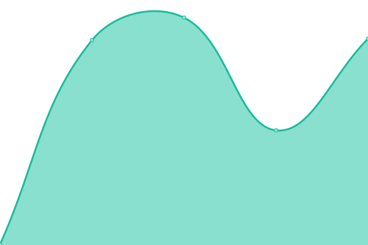 331ms
     
 | 

<a href="https://GiuseppeFilingeri.github.io/upgraded-symmetrical-waddle/history/hardindd">0.00%</a>
    

|  [minerals](minerals.net) | 🟥 Down | [minerals.yml](https://github.com/GiuseppeFilingeri/upgraded-symmetrical-waddle/commits/HEAD/history/minerals.yml) | 

 0ms
     
 | 

<a href="https://GiuseppeFilingeri.github.io/upgraded-symmetrical-waddle/history/minerals">0.00%</a>
    

|  [detonics](detonics.com) | 🟩 Up | [detonics.yml](https://github.com/GiuseppeFilingeri/upgraded-symmetrical-waddle/commits/HEAD/history/detonics.yml) | 

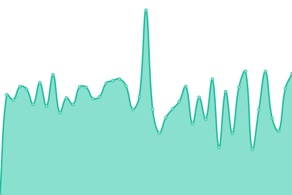 998ms
     
 | 

<a href="https://GiuseppeFilingeri.github.io/upgraded-symmetrical-waddle/history/detonics">56.30%</a>
    

|  [zap](zap.com.br) | 🟥 Down | [zap.yml](https://github.com/GiuseppeFilingeri/upgraded-symmetrical-waddle/commits/HEAD/history/zap.yml) | 

 551ms
     
 | 

<a href="https://GiuseppeFilingeri.github.io/upgraded-symmetrical-waddle/history/zap">0.00%</a>
    

|  [penisdicke](penisdicke.de) | 🟩 Up | [penisdicke.yml](https://github.com/GiuseppeFilingeri/upgraded-symmetrical-waddle/commits/HEAD/history/penisdicke.yml) | 

 422ms
     
 | 

<a href="https://GiuseppeFilingeri.github.io/upgraded-symmetrical-waddle/history/penisdicke">63.34%</a>
    

|  [penispedia](penispedia.de) | 🟩 Up | [penispedia.yml](https://github.com/GiuseppeFilingeri/upgraded-symmetrical-waddle/commits/HEAD/history/penispedia.yml) | 

 392ms
     
 | 

<a href="https://GiuseppeFilingeri.github.io/upgraded-symmetrical-waddle/history/penispedia">100.00%</a>
    

|  [motoscustom](motoscustom.es) | 🟥 Down | [motoscustom.yml](https://github.com/GiuseppeFilingeri/upgraded-symmetrical-waddle/commits/HEAD/history/motoscustom.yml) | 

 0ms
     
 | 

<a href="https://GiuseppeFilingeri.github.io/upgraded-symmetrical-waddle/history/motoscustom">0.00%</a>
    

|  [subssearch](subssearch.com) | 🟥 Down | [subssearch.yml](https://github.com/GiuseppeFilingeri/upgraded-symmetrical-waddle/commits/HEAD/history/subssearch.yml) | 

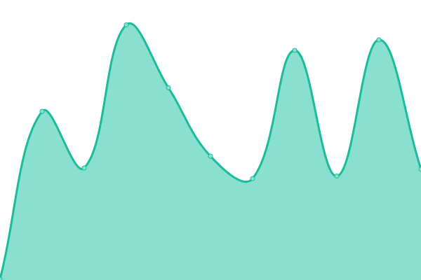 135ms
     
 | 

<a href="https://GiuseppeFilingeri.github.io/upgraded-symmetrical-waddle/history/subssearch">0.00%</a>
    

|  [inoforum](inoforum.ru) | 🟥 Down | [inoforum.yml](https://github.com/GiuseppeFilingeri/upgraded-symmetrical-waddle/commits/HEAD/history/inoforum.yml) | 

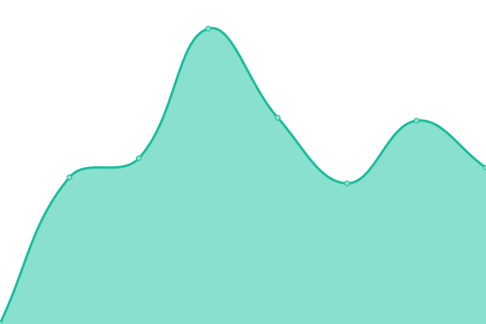 0ms
     
 | 

<a href="https://GiuseppeFilingeri.github.io/upgraded-symmetrical-waddle/history/inoforum">0.00%</a>
    

|  [zdrente](zdrente.com) | 🟥 Down | [zdrente.yml](https://github.com/GiuseppeFilingeri/upgraded-symmetrical-waddle/commits/HEAD/history/zdrente.yml) | 

 0ms
     
 | 

<a href="https://GiuseppeFilingeri.github.io/upgraded-symmetrical-waddle/history/zdrente">100.00%</a>
    

|  [zdrente](zdrente.com) | 🟥 Down | [zdrente.yml](https://github.com/GiuseppeFilingeri/upgraded-symmetrical-waddle/commits/HEAD/history/zdrente.yml) | 

 0ms
     
 | 

<a href="https://GiuseppeFilingeri.github.io/upgraded-symmetrical-waddle/history/zdrente">100.00%</a>
    

|  [myanmarhoo](myanmarhoo.com) | 🟥 Down | [myanmarhoo.yml](https://github.com/GiuseppeFilingeri/upgraded-symmetrical-waddle/commits/HEAD/history/myanmarhoo.yml) | 

 0ms
     
 | 

<a href="https://GiuseppeFilingeri.github.io/upgraded-symmetrical-waddle/history/myanmarhoo">100.00%</a>
    

|  [Ojolink](Ojolink.net) | 🟩 Up | [ojolink.yml](https://github.com/GiuseppeFilingeri/upgraded-symmetrical-waddle/commits/HEAD/history/ojolink.yml) | 

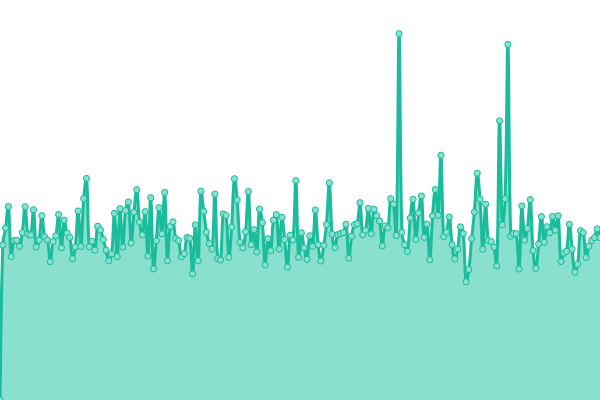 2043ms
     
 | 

<a href="https://GiuseppeFilingeri.github.io/upgraded-symmetrical-waddle/history/ojolink">100.00%</a>
    

|  [ojolink](ojolink.net) | 🟩 Up | [ojolink.yml](https://github.com/GiuseppeFilingeri/upgraded-symmetrical-waddle/commits/HEAD/history/ojolink.yml) | 

 2043ms
     
 | 

<a href="https://GiuseppeFilingeri.github.io/upgraded-symmetrical-waddle/history/ojolink">100.00%</a>
    

|  [ojolink](ojolink.fr) | 🟩 Up | [ojolink.yml](https://github.com/GiuseppeFilingeri/upgraded-symmetrical-waddle/commits/HEAD/history/ojolink.yml) | 

 2043ms
     
 | 

<a href="https://GiuseppeFilingeri.github.io/upgraded-symmetrical-waddle/history/ojolink">100.00%</a>
    

|  [juegosipo](juegosipo.com) | 🟩 Up | [juegosipo.yml](https://github.com/GiuseppeFilingeri/upgraded-symmetrical-waddle/commits/HEAD/history/juegosipo.yml) | 

 352ms
     
 | 

<a href="https://GiuseppeFilingeri.github.io/upgraded-symmetrical-waddle/history/juegosipo">100.00%</a>
    

|  [just-elle](just-elle.com) | 🟩 Up | [just-elle.yml](https://github.com/GiuseppeFilingeri/upgraded-symmetrical-waddle/commits/HEAD/history/just-elle.yml) | 

 660ms
     
 | 

<a href="https://GiuseppeFilingeri.github.io/upgraded-symmetrical-waddle/history/just-elle">0.00%</a>
    

|  [myspace](myspace.com) | 🟩 Up | [myspace.yml](https://github.com/GiuseppeFilingeri/upgraded-symmetrical-waddle/commits/HEAD/history/myspace.yml) | 

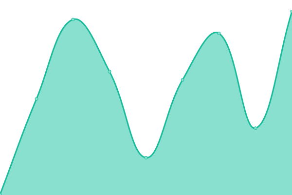 375ms
     
 | 

<a href="https://GiuseppeFilingeri.github.io/upgraded-symmetrical-waddle/history/myspace">100.00%</a>
    

|  [xjp](xjp.cc) | 🟥 Down | [xjp.yml](https://github.com/GiuseppeFilingeri/upgraded-symmetrical-waddle/commits/HEAD/history/xjp.yml) | 

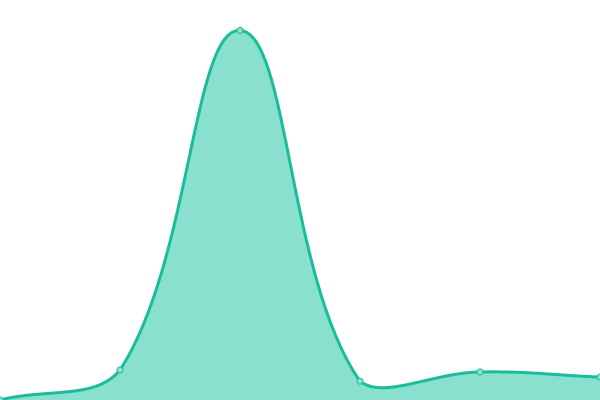 0ms
     
 | 

<a href="https://GiuseppeFilingeri.github.io/upgraded-symmetrical-waddle/history/xjp">0.00%</a>
    

|  [xnxx](xnxx.com) | 🟩 Up | [xnxx.yml](https://github.com/GiuseppeFilingeri/upgraded-symmetrical-waddle/commits/HEAD/history/xnxx.yml) | 

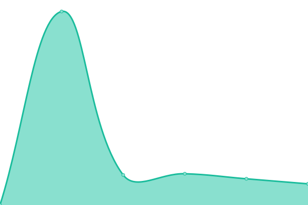 2697ms
     
 | 

<a href="https://GiuseppeFilingeri.github.io/upgraded-symmetrical-waddle/history/xnxx">100.00%</a>
    

|  [fantasti](fantasti.cc) | 🟥 Down | [fantasti.yml](https://github.com/GiuseppeFilingeri/upgraded-symmetrical-waddle/commits/HEAD/history/fantasti.yml) | 

 0ms
     
 | 

<a href="https://GiuseppeFilingeri.github.io/upgraded-symmetrical-waddle/history/fantasti">0.00%</a>
    

|  [youjizz](youjizz.com) | 🟩 Up | [youjizz.yml](https://github.com/GiuseppeFilingeri/upgraded-symmetrical-waddle/commits/HEAD/history/youjizz.yml) | 

 3027ms
     
 | 

<a href="https://GiuseppeFilingeri.github.io/upgraded-symmetrical-waddle/history/youjizz">0.00%</a>
    

|  [Wide6](Wide6.com) | 🟥 Down | [wide6.yml](https://github.com/GiuseppeFilingeri/upgraded-symmetrical-waddle/commits/HEAD/history/wide6.yml) | 

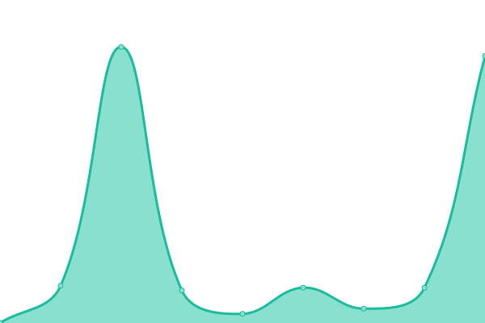 0ms
     
 | 

<a href="https://GiuseppeFilingeri.github.io/upgraded-symmetrical-waddle/history/wide6">0.00%</a>
    

|  [wide6](wide6.com) | 🟥 Down | [wide6.yml](https://github.com/GiuseppeFilingeri/upgraded-symmetrical-waddle/commits/HEAD/history/wide6.yml) | 

 0ms
     
 | 

<a href="https://GiuseppeFilingeri.github.io/upgraded-symmetrical-waddle/history/wide6">0.00%</a>
    

|  [pornfuze](pornfuze.com) | 🟩 Up | [pornfuze.yml](https://github.com/GiuseppeFilingeri/upgraded-symmetrical-waddle/commits/HEAD/history/pornfuze.yml) | 

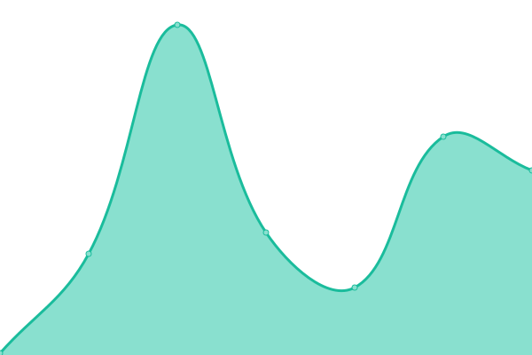 607ms
     
 | 

<a href="https://GiuseppeFilingeri.github.io/upgraded-symmetrical-waddle/history/pornfuze">76.16%</a>
    

|  [porntitan](porntitan.com) | 🟥 Down | [porntitan.yml](https://github.com/GiuseppeFilingeri/upgraded-symmetrical-waddle/commits/HEAD/history/porntitan.yml) | 

 0ms
     
 | 

<a href="https://GiuseppeFilingeri.github.io/upgraded-symmetrical-waddle/history/porntitan">0.00%</a>
    

|  [pornchilli](pornchilli.com) | 🟥 Down | [pornchilli.yml](https://github.com/GiuseppeFilingeri/upgraded-symmetrical-waddle/commits/HEAD/history/pornchilli.yml) | 

 0ms
     
 | 

<a href="https://GiuseppeFilingeri.github.io/upgraded-symmetrical-waddle/history/pornchilli">100.00%</a>
    

|  [4tube](4tube.com) | 🟩 Up | [4tube.yml](https://github.com/GiuseppeFilingeri/upgraded-symmetrical-waddle/commits/HEAD/history/4tube.yml) | 

 557ms
     
 | 

<a href="https://GiuseppeFilingeri.github.io/upgraded-symmetrical-waddle/history/4tube">0.00%</a>
    

|  [pornrabbit](pornrabbit.com) | 🟩 Up | [pornrabbit.yml](https://github.com/GiuseppeFilingeri/upgraded-symmetrical-waddle/commits/HEAD/history/pornrabbit.yml) | 

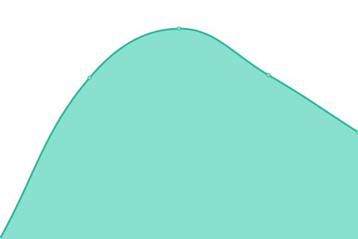 387ms
     
 | 

<a href="https://GiuseppeFilingeri.github.io/upgraded-symmetrical-waddle/history/pornrabbit">100.00%</a>
    

|  [eatbigbuns](eatbigbuns.com) | 🟩 Up | [eatbigbuns.yml](https://github.com/GiuseppeFilingeri/upgraded-symmetrical-waddle/commits/HEAD/history/eatbigbuns.yml) | 

 365ms
     
 | 

<a href="https://GiuseppeFilingeri.github.io/upgraded-symmetrical-waddle/history/eatbigbuns">100.00%</a>
    

|  [commencal](commencal.com) | 🟩 Up | [commencal.yml](https://github.com/GiuseppeFilingeri/upgraded-symmetrical-waddle/commits/HEAD/history/commencal.yml) | 

 961ms
     
 | 

<a href="https://GiuseppeFilingeri.github.io/upgraded-symmetrical-waddle/history/commencal">100.00%</a>
    

|  [harlotwear](harlotwear.com) | 🟥 Down | [harlotwear.yml](https://github.com/GiuseppeFilingeri/upgraded-symmetrical-waddle/commits/HEAD/history/harlotwear.yml) | 

 0ms
     
 | 

<a href="https://GiuseppeFilingeri.github.io/upgraded-symmetrical-waddle/history/harlotwear">0.00%</a>
    

|  [classnotes](classnotes.com) | 🟩 Up | [classnotes.yml](https://github.com/GiuseppeFilingeri/upgraded-symmetrical-waddle/commits/HEAD/history/classnotes.yml) | 

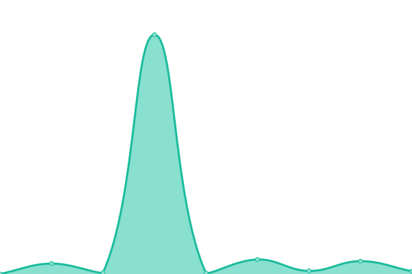 2569ms
     
 | 

<a href="https://GiuseppeFilingeri.github.io/upgraded-symmetrical-waddle/history/classnotes">100.00%</a>
    

|  [classnotes](classnotes.com) | 🟩 Up | [classnotes.yml](https://github.com/GiuseppeFilingeri/upgraded-symmetrical-waddle/commits/HEAD/history/classnotes.yml) | 

 2569ms
     
 | 

<a href="https://GiuseppeFilingeri.github.io/upgraded-symmetrical-waddle/history/classnotes">100.00%</a>
    

|  [asgreenas](asgreenas.com) | 🟥 Down | [asgreenas.yml](https://github.com/GiuseppeFilingeri/upgraded-symmetrical-waddle/commits/HEAD/history/asgreenas.yml) | 

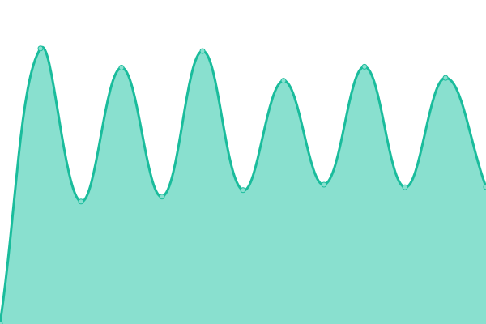 0ms
     
 | 

<a href="https://GiuseppeFilingeri.github.io/upgraded-symmetrical-waddle/history/asgreenas">0.00%</a>
    

|  [asgreenas](asgreenas.com) | 🟥 Down | [asgreenas.yml](https://github.com/GiuseppeFilingeri/upgraded-symmetrical-waddle/commits/HEAD/history/asgreenas.yml) | 

 0ms
     
 | 

<a href="https://GiuseppeFilingeri.github.io/upgraded-symmetrical-waddle/history/asgreenas">0.00%</a>
    

|  [zshareblog](zshareblog.com) | 🟥 Down | [zshareblog.yml](https://github.com/GiuseppeFilingeri/upgraded-symmetrical-waddle/commits/HEAD/history/zshareblog.yml) | 

 0ms
     
 | 

<a href="https://GiuseppeFilingeri.github.io/upgraded-symmetrical-waddle/history/zshareblog">0.00%</a>
    

|  [Nasir](Nasir.com) | 🟥 Down | [nasir.yml](https://github.com/GiuseppeFilingeri/upgraded-symmetrical-waddle/commits/HEAD/history/nasir.yml) | 

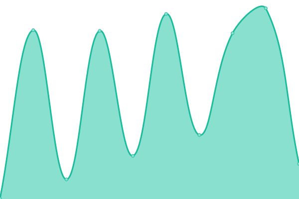 0ms
     
 | 

<a href="https://GiuseppeFilingeri.github.io/upgraded-symmetrical-waddle/history/nasir">0.00%</a>
    

|  [nasir](nasir.com) | 🟥 Down | [nasir.yml](https://github.com/GiuseppeFilingeri/upgraded-symmetrical-waddle/commits/HEAD/history/nasir.yml) | 

 0ms
     
 | 

<a href="https://GiuseppeFilingeri.github.io/upgraded-symmetrical-waddle/history/nasir">0.00%</a>
    

|  [gb13](gb13.com) | 🟥 Down | [gb13.yml](https://github.com/GiuseppeFilingeri/upgraded-symmetrical-waddle/commits/HEAD/history/gb13.yml) | 

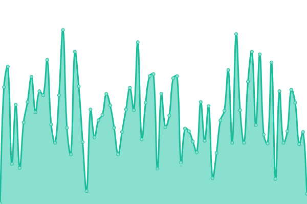 0ms
     
 | 

<a href="https://GiuseppeFilingeri.github.io/upgraded-symmetrical-waddle/history/gb13">100.00%</a>
    

|  [gb13](gb13.com) | 🟥 Down | [gb13.yml](https://github.com/GiuseppeFilingeri/upgraded-symmetrical-waddle/commits/HEAD/history/gb13.yml) | 

 0ms
     
 | 

<a href="https://GiuseppeFilingeri.github.io/upgraded-symmetrical-waddle/history/gb13">100.00%</a>
    

|  [pal-mafia](pal-mafia.com) | 🟥 Down | [pal-mafia.yml](https://github.com/GiuseppeFilingeri/upgraded-symmetrical-waddle/commits/HEAD/history/pal-mafia.yml) | 

 0ms
     
 | 

<a href="https://GiuseppeFilingeri.github.io/upgraded-symmetrical-waddle/history/pal-mafia">0.00%</a>
    

|  [emu](emu.edu) | 🟩 Up | [emu.yml](https://github.com/GiuseppeFilingeri/upgraded-symmetrical-waddle/commits/HEAD/history/emu.yml) | 

 250ms
     
 | 

<a href="https://GiuseppeFilingeri.github.io/upgraded-symmetrical-waddle/history/emu">0.00%</a>
    

|  [rapishare](rapishare.com) | 🟩 Up | [rapishare.yml](https://github.com/GiuseppeFilingeri/upgraded-symmetrical-waddle/commits/HEAD/history/rapishare.yml) | 

 280ms
     
 | 

<a href="https://GiuseppeFilingeri.github.io/upgraded-symmetrical-waddle/history/rapishare">69.63%</a>
    

|  [rapishare](rapishare.com) | 🟩 Up | [rapishare.yml](https://github.com/GiuseppeFilingeri/upgraded-symmetrical-waddle/commits/HEAD/history/rapishare.yml) | 

 280ms
     
 | 

<a href="https://GiuseppeFilingeri.github.io/upgraded-symmetrical-waddle/history/rapishare">69.63%</a>
    

|  [gadgethouse](gadgethouse.nl) | 🟩 Up | [gadgethouse.yml](https://github.com/GiuseppeFilingeri/upgraded-symmetrical-waddle/commits/HEAD/history/gadgethouse.yml) | 

 3387ms
     
 | 

<a href="https://GiuseppeFilingeri.github.io/upgraded-symmetrical-waddle/history/gadgethouse">60.47%</a>
    

|  [adult-mate](adult-mate.com) | 🟥 Down | [adult-mate.yml](https://github.com/GiuseppeFilingeri/upgraded-symmetrical-waddle/commits/HEAD/history/adult-mate.yml) | 

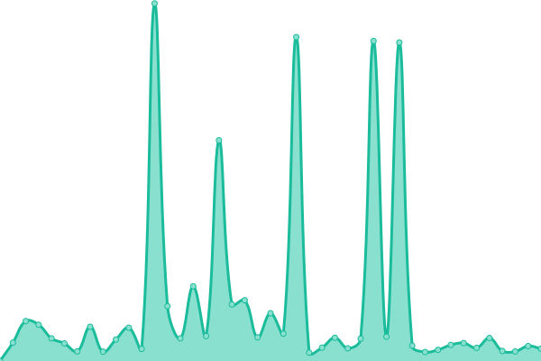 0ms
     
 | 

<a href="https://GiuseppeFilingeri.github.io/upgraded-symmetrical-waddle/history/adult-mate">0.00%</a>
    

|  [clixsence](clixsence.com) | 🟩 Up | [clixsence.yml](https://github.com/GiuseppeFilingeri/upgraded-symmetrical-waddle/commits/HEAD/history/clixsence.yml) | 

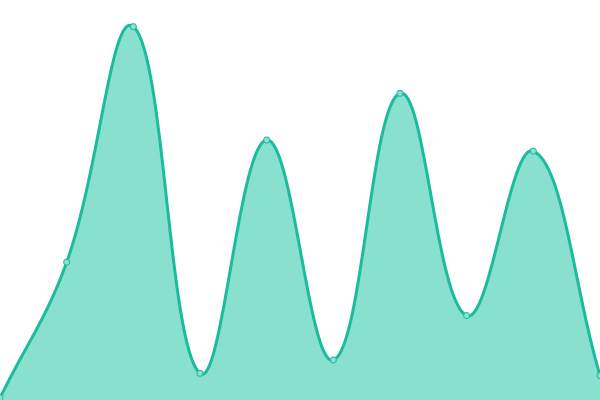 2666ms
     
 | 

<a href="https://GiuseppeFilingeri.github.io/upgraded-symmetrical-waddle/history/clixsence">78.05%</a>
    

|  [clixsence](clixsence.com) | 🟩 Up | [clixsence.yml](https://github.com/GiuseppeFilingeri/upgraded-symmetrical-waddle/commits/HEAD/history/clixsence.yml) | 

 2666ms
     
 | 

<a href="https://GiuseppeFilingeri.github.io/upgraded-symmetrical-waddle/history/clixsence">78.05%</a>
    

|  [mclub](mclub.com.ua) | 🟩 Up | [mclub.yml](https://github.com/GiuseppeFilingeri/upgraded-symmetrical-waddle/commits/HEAD/history/mclub.yml) | 

 5084ms
     
 | 

<a href="https://GiuseppeFilingeri.github.io/upgraded-symmetrical-waddle/history/mclub">0.00%</a>
    

|  [higou](higou.net) | 🟩 Up | [higou.yml](https://github.com/GiuseppeFilingeri/upgraded-symmetrical-waddle/commits/HEAD/history/higou.yml) | 

 335ms
     
 | 

<a href="https://GiuseppeFilingeri.github.io/upgraded-symmetrical-waddle/history/higou">0.00%</a>
    

|  [privatebay](privatebay.com) | 🟩 Up | [privatebay.yml](https://github.com/GiuseppeFilingeri/upgraded-symmetrical-waddle/commits/HEAD/history/privatebay.yml) | 

 341ms
     
 | 

<a href="https://GiuseppeFilingeri.github.io/upgraded-symmetrical-waddle/history/privatebay">18.39%</a>
    

|  [frater](frater.org) | 🟩 Up | [frater.yml](https://github.com/GiuseppeFilingeri/upgraded-symmetrical-waddle/commits/HEAD/history/frater.yml) | 

 807ms
     
 | 

<a href="https://GiuseppeFilingeri.github.io/upgraded-symmetrical-waddle/history/frater">99.82%</a>
    

|  [stork](stork.pk) | 🟥 Down | [stork.yml](https://github.com/GiuseppeFilingeri/upgraded-symmetrical-waddle/commits/HEAD/history/stork.yml) | 

 0ms
     
 | 

<a href="https://GiuseppeFilingeri.github.io/upgraded-symmetrical-waddle/history/stork">100.00%</a>
    

|  [makelaar-nl](makelaar-nl.nl) | 🟥 Down | [makelaar-nl.yml](https://github.com/GiuseppeFilingeri/upgraded-symmetrical-waddle/commits/HEAD/history/makelaar-nl.yml) | 

 0ms
     
 | 

<a href="https://GiuseppeFilingeri.github.io/upgraded-symmetrical-waddle/history/makelaar-nl">100.00%</a>
    

|  [feest-idee](feest-idee.nl) | 🟩 Up | [feest-idee.yml](https://github.com/GiuseppeFilingeri/upgraded-symmetrical-waddle/commits/HEAD/history/feest-idee.yml) | 

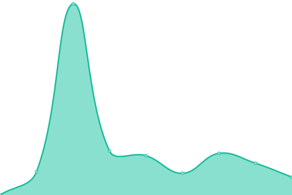 979ms
     
 | 

<a href="https://GiuseppeFilingeri.github.io/upgraded-symmetrical-waddle/history/feest-idee">0.00%</a>
    

|  [feest-start](feest-start.nl) | 🟩 Up | [feest-start.yml](https://github.com/GiuseppeFilingeri/upgraded-symmetrical-waddle/commits/HEAD/history/feest-start.yml) | 

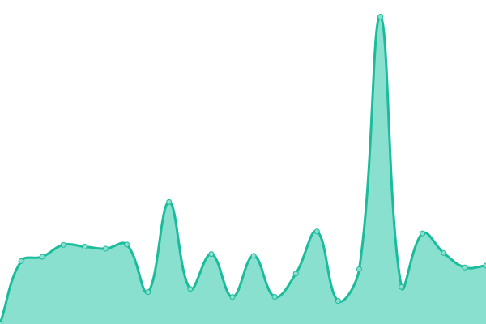 2569ms
     
 | 

<a href="https://GiuseppeFilingeri.github.io/upgraded-symmetrical-waddle/history/feest-start">75.96%</a>
    

|  [groepsfeest](groepsfeest.nl) | 🟩 Up | [groepsfeest.yml](https://github.com/GiuseppeFilingeri/upgraded-symmetrical-waddle/commits/HEAD/history/groepsfeest.yml) | 

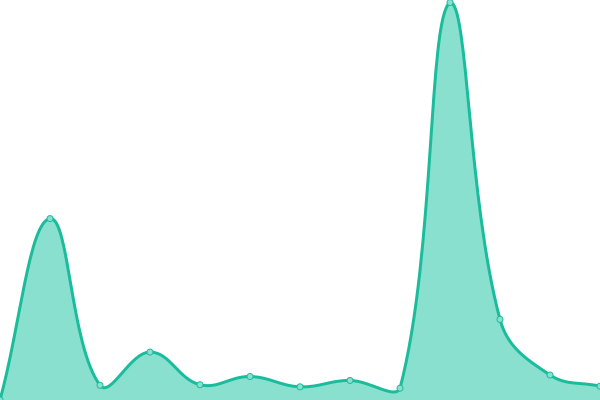 672ms
     
 | 

<a href="https://GiuseppeFilingeri.github.io/upgraded-symmetrical-waddle/history/groepsfeest">100.00%</a>
    

|  [groepsfeest](groepsfeest.nl) | 🟩 Up | [groepsfeest.yml](https://github.com/GiuseppeFilingeri/upgraded-symmetrical-waddle/commits/HEAD/history/groepsfeest.yml) | 

 672ms
     
 | 

<a href="https://GiuseppeFilingeri.github.io/upgraded-symmetrical-waddle/history/groepsfeest">100.00%</a>
    

|  [feestid](feestid.nl) | 🟩 Up | [feestid.yml](https://github.com/GiuseppeFilingeri/upgraded-symmetrical-waddle/commits/HEAD/history/feestid.yml) | 

 3383ms
     
 | 

<a href="https://GiuseppeFilingeri.github.io/upgraded-symmetrical-waddle/history/feestid">98.73%</a>
    

|  [toptrips](toptrips.com) | 🟩 Up | [toptrips.yml](https://github.com/GiuseppeFilingeri/upgraded-symmetrical-waddle/commits/HEAD/history/toptrips.yml) | 

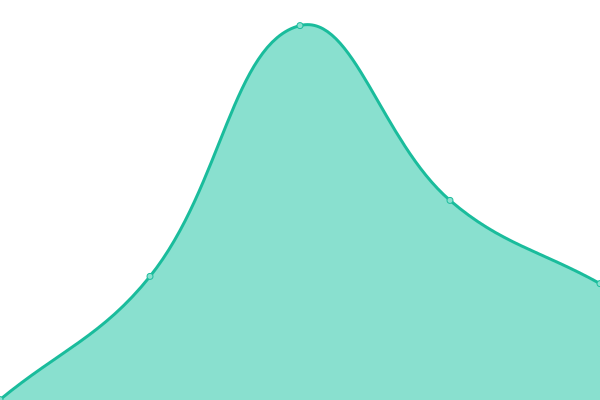 357ms
     
 | 

<a href="https://GiuseppeFilingeri.github.io/upgraded-symmetrical-waddle/history/toptrips">100.00%</a>
    

|  [letsgo](letsgo.com) | 🟩 Up | [letsgo.yml](https://github.com/GiuseppeFilingeri/upgraded-symmetrical-waddle/commits/HEAD/history/letsgo.yml) | 

 483ms
     
 | 

<a href="https://GiuseppeFilingeri.github.io/upgraded-symmetrical-waddle/history/letsgo">100.00%</a>
    

|  [unp](unp.com) | 🟩 Up | [unp.yml](https://github.com/GiuseppeFilingeri/upgraded-symmetrical-waddle/commits/HEAD/history/unp.yml) | 

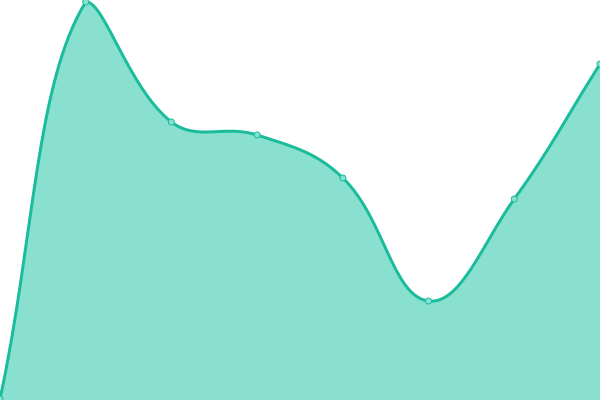 190ms
     
 | 

<a href="https://GiuseppeFilingeri.github.io/upgraded-symmetrical-waddle/history/unp">99.70%</a>
    

|  [isai](isai.in) | 🟩 Up | [isai.yml](https://github.com/GiuseppeFilingeri/upgraded-symmetrical-waddle/commits/HEAD/history/isai.yml) | 

 156ms
     
 | 

<a href="https://GiuseppeFilingeri.github.io/upgraded-symmetrical-waddle/history/isai">88.22%</a>
    

|  [hwh](hwh.com) | 🟥 Down | [hwh.yml](https://github.com/GiuseppeFilingeri/upgraded-symmetrical-waddle/commits/HEAD/history/hwh.yml) | 

 0ms
     
 | 

<a href="https://GiuseppeFilingeri.github.io/upgraded-symmetrical-waddle/history/hwh">0.00%</a>
    

|  [babcock](babcock.co.uk) | 🟩 Up | [babcock.yml](https://github.com/GiuseppeFilingeri/upgraded-symmetrical-waddle/commits/HEAD/history/babcock.yml) | 

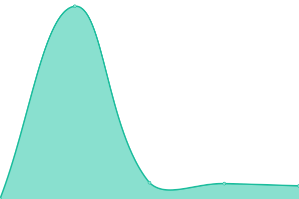 355ms
     
 | 

<a href="https://GiuseppeFilingeri.github.io/upgraded-symmetrical-waddle/history/babcock">0.00%</a>
    

|  [watches](watches.de) | 🟩 Up | [watches.yml](https://github.com/GiuseppeFilingeri/upgraded-symmetrical-waddle/commits/HEAD/history/watches.yml) | 

 3215ms
     
 | 

<a href="https://GiuseppeFilingeri.github.io/upgraded-symmetrical-waddle/history/watches">100.00%</a>
    

|  [galaxygui](galaxygui.net) | 🟥 Down | [galaxygui.yml](https://github.com/GiuseppeFilingeri/upgraded-symmetrical-waddle/commits/HEAD/history/galaxygui.yml) | 

 0ms
     
 | 

<a href="https://GiuseppeFilingeri.github.io/upgraded-symmetrical-waddle/history/galaxygui">100.00%</a>
    

|  [digobrands](digobrands.com) | 🟩 Up | [digobrands.yml](https://github.com/GiuseppeFilingeri/upgraded-symmetrical-waddle/commits/HEAD/history/digobrands.yml) | 

 899ms
     
 | 

<a href="https://GiuseppeFilingeri.github.io/upgraded-symmetrical-waddle/history/digobrands">1.05%</a>
    

|  [bgescape](bgescape.com) | 🟥 Down | [bgescape.yml](https://github.com/GiuseppeFilingeri/upgraded-symmetrical-waddle/commits/HEAD/history/bgescape.yml) | 

 0ms
     
 | 

<a href="https://GiuseppeFilingeri.github.io/upgraded-symmetrical-waddle/history/bgescape">0.00%</a>
    

|  [scottdrake](scottdrake.com) | 🟥 Down | [scottdrake.yml](https://github.com/GiuseppeFilingeri/upgraded-symmetrical-waddle/commits/HEAD/history/scottdrake.yml) | 

 0ms
     
 | 

<a href="https://GiuseppeFilingeri.github.io/upgraded-symmetrical-waddle/history/scottdrake">0.00%</a>
    

|  [futera](futera.com) | 🟩 Up | [futera.yml](https://github.com/GiuseppeFilingeri/upgraded-symmetrical-waddle/commits/HEAD/history/futera.yml) | 

 1980ms
     
 | 

<a href="https://GiuseppeFilingeri.github.io/upgraded-symmetrical-waddle/history/futera">100.00%</a>
    

|  [strefa](strefa.co.uk) | 🟩 Up | [strefa.yml](https://github.com/GiuseppeFilingeri/upgraded-symmetrical-waddle/commits/HEAD/history/strefa.yml) | 

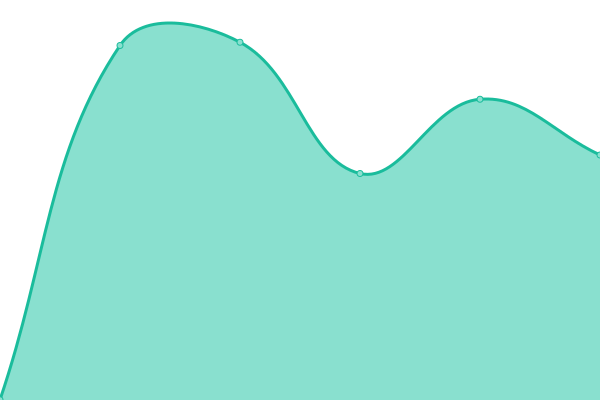 891ms
     
 | 

<a href="https://GiuseppeFilingeri.github.io/upgraded-symmetrical-waddle/history/strefa">100.00%</a>
    

|  [axess](axess.se) | 🟩 Up | [axess.yml](https://github.com/GiuseppeFilingeri/upgraded-symmetrical-waddle/commits/HEAD/history/axess.yml) | 

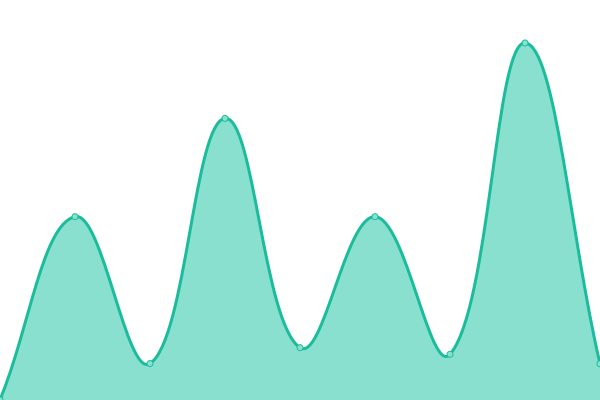 1763ms
     
 | 

<a href="https://GiuseppeFilingeri.github.io/upgraded-symmetrical-waddle/history/axess">100.00%</a>
    

|  [axess](axess.se) | 🟩 Up | [axess.yml](https://github.com/GiuseppeFilingeri/upgraded-symmetrical-waddle/commits/HEAD/history/axess.yml) | 

 1763ms
     
 | 

<a href="https://GiuseppeFilingeri.github.io/upgraded-symmetrical-waddle/history/axess">100.00%</a>
    

|  [ikarusc42](ikarusc42.info) | 🟥 Down | [ikarusc42.yml](https://github.com/GiuseppeFilingeri/upgraded-symmetrical-waddle/commits/HEAD/history/ikarusc42.yml) | 

 0ms
     
 | 

<a href="https://GiuseppeFilingeri.github.io/upgraded-symmetrical-waddle/history/ikarusc42">100.00%</a>
    

|  [ds-girls](ds-girls.nl) | 🟩 Up | [ds-girls.yml](https://github.com/GiuseppeFilingeri/upgraded-symmetrical-waddle/commits/HEAD/history/ds-girls.yml) | 

 1470ms
     
 | 

<a href="https://GiuseppeFilingeri.github.io/upgraded-symmetrical-waddle/history/ds-girls">100.00%</a>
    

|  [murocortina](murocortina.es) | 🟩 Up | [murocortina.yml](https://github.com/GiuseppeFilingeri/upgraded-symmetrical-waddle/commits/HEAD/history/murocortina.yml) | 

 1421ms
     
 | 

<a href="https://GiuseppeFilingeri.github.io/upgraded-symmetrical-waddle/history/murocortina">99.82%</a>
    

|  [diodosled](diodosled.com) | 🟥 Down | [diodosled.yml](https://github.com/GiuseppeFilingeri/upgraded-symmetrical-waddle/commits/HEAD/history/diodosled.yml) | 

 0ms
     
 | 

<a href="https://GiuseppeFilingeri.github.io/upgraded-symmetrical-waddle/history/diodosled">100.00%</a>
    

|  [nacaranta](nacaranta.com) | 🟩 Up | [nacaranta.yml](https://github.com/GiuseppeFilingeri/upgraded-symmetrical-waddle/commits/HEAD/history/nacaranta.yml) | 

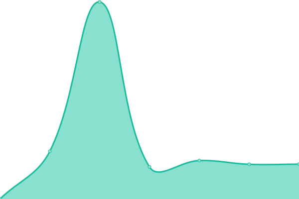 1137ms
     
 | 

<a href="https://GiuseppeFilingeri.github.io/upgraded-symmetrical-waddle/history/nacaranta">32.14%</a>
    

|  [uzboys](uzboys.com) | 🟥 Down | [uzboys.yml](https://github.com/GiuseppeFilingeri/upgraded-symmetrical-waddle/commits/HEAD/history/uzboys.yml) | 

 0ms
     
 | 

<a href="https://GiuseppeFilingeri.github.io/upgraded-symmetrical-waddle/history/uzboys">0.00%</a>
    

|  [ripurl](ripurl.co.uk) | 🟥 Down | [ripurl.yml](https://github.com/GiuseppeFilingeri/upgraded-symmetrical-waddle/commits/HEAD/history/ripurl.yml) | 

 0ms
     
 | 

<a href="https://GiuseppeFilingeri.github.io/upgraded-symmetrical-waddle/history/ripurl">100.00%</a>
    

|  [ripurl](ripurl.co.uk) | 🟥 Down | [ripurl.yml](https://github.com/GiuseppeFilingeri/upgraded-symmetrical-waddle/commits/HEAD/history/ripurl.yml) | 

 0ms
     
 | 

<a href="https://GiuseppeFilingeri.github.io/upgraded-symmetrical-waddle/history/ripurl">100.00%</a>
    

|  [metroflog](metroflog.com) | 🟩 Up | [metroflog.yml](https://github.com/GiuseppeFilingeri/upgraded-symmetrical-waddle/commits/HEAD/history/metroflog.yml) | 

 97ms
     
 | 

<a href="https://GiuseppeFilingeri.github.io/upgraded-symmetrical-waddle/history/metroflog">68.33%</a>
    

|  [iFight365](iFight365.com) | 🟩 Up | [i-fight365.yml](https://github.com/GiuseppeFilingeri/upgraded-symmetrical-waddle/commits/HEAD/history/i-fight365.yml) | 

 1847ms
     
 | 

<a href="https://GiuseppeFilingeri.github.io/upgraded-symmetrical-waddle/history/i-fight365">100.00%</a>
    

|  [ifight365](ifight365.com) | 🟩 Up | [ifight365.yml](https://github.com/GiuseppeFilingeri/upgraded-symmetrical-waddle/commits/HEAD/history/ifight365.yml) | 

 1421ms
     
 | 

<a href="https://GiuseppeFilingeri.github.io/upgraded-symmetrical-waddle/history/ifight365">100.00%</a>
    

|  [simerini](simerini.com) | 🟩 Up | [simerini.yml](https://github.com/GiuseppeFilingeri/upgraded-symmetrical-waddle/commits/HEAD/history/simerini.yml) | 

 1077ms
     
 | 

<a href="https://GiuseppeFilingeri.github.io/upgraded-symmetrical-waddle/history/simerini">100.00%</a>
    

|  [4gifs](4gifs.com) | 🟩 Up | [4gifs.yml](https://github.com/GiuseppeFilingeri/upgraded-symmetrical-waddle/commits/HEAD/history/4gifs.yml) | 

 271ms
     
 | 

<a href="https://GiuseppeFilingeri.github.io/upgraded-symmetrical-waddle/history/4gifs">0.00%</a>
    

|  [tronix](tronix.co.nz) | 🟥 Down | [tronix.yml](https://github.com/GiuseppeFilingeri/upgraded-symmetrical-waddle/commits/HEAD/history/tronix.yml) | 

 0ms
     
 | 

<a href="https://GiuseppeFilingeri.github.io/upgraded-symmetrical-waddle/history/tronix">100.00%</a>
    

|  [torrentzap](torrentzap.com) | 🟥 Down | [torrentzap.yml](https://github.com/GiuseppeFilingeri/upgraded-symmetrical-waddle/commits/HEAD/history/torrentzap.yml) | 

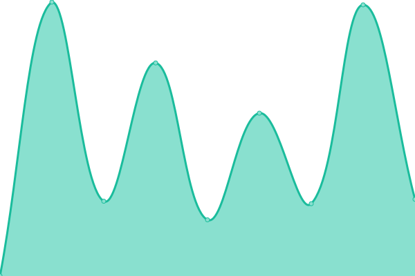 0ms
     
 | 

<a href="https://GiuseppeFilingeri.github.io/upgraded-symmetrical-waddle/history/torrentzap">0.00%</a>
    

|  [torrentzap](torrentzap.com) | 🟥 Down | [torrentzap.yml](https://github.com/GiuseppeFilingeri/upgraded-symmetrical-waddle/commits/HEAD/history/torrentzap.yml) | 

 0ms
     
 | 

<a href="https://GiuseppeFilingeri.github.io/upgraded-symmetrical-waddle/history/torrentzap">0.00%</a>
    

|  [wzforumz](wzforumz.org) | 🟥 Down | [wzforumz.yml](https://github.com/GiuseppeFilingeri/upgraded-symmetrical-waddle/commits/HEAD/history/wzforumz.yml) | 

 0ms
     
 | 

<a href="https://GiuseppeFilingeri.github.io/upgraded-symmetrical-waddle/history/wzforumz">100.00%</a>
    

|  [benjohnson](benjohnson.com) | 🟩 Up | [benjohnson.yml](https://github.com/GiuseppeFilingeri/upgraded-symmetrical-waddle/commits/HEAD/history/benjohnson.yml) | 

 1959ms
     
 | 

<a href="https://GiuseppeFilingeri.github.io/upgraded-symmetrical-waddle/history/benjohnson">0.00%</a>
    

|  [lings](lings.com) | 🟩 Up | [lings.yml](https://github.com/GiuseppeFilingeri/upgraded-symmetrical-waddle/commits/HEAD/history/lings.yml) | 

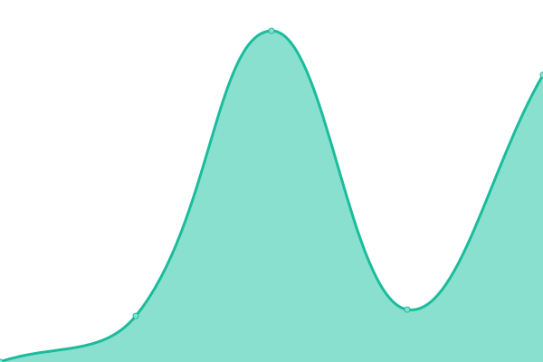 731ms
     
 | 

<a href="https://GiuseppeFilingeri.github.io/upgraded-symmetrical-waddle/history/lings">95.16%</a>
    

|  [otrjobs](otrjobs.net) | 🟩 Up | [otrjobs.yml](https://github.com/GiuseppeFilingeri/upgraded-symmetrical-waddle/commits/HEAD/history/otrjobs.yml) | 

 415ms
     
 | 

<a href="https://GiuseppeFilingeri.github.io/upgraded-symmetrical-waddle/history/otrjobs">100.00%</a>
    

|  [fireeq](fireeq.net) | 🟥 Down | [fireeq.yml](https://github.com/GiuseppeFilingeri/upgraded-symmetrical-waddle/commits/HEAD/history/fireeq.yml) | 

 0ms
     
 | 

<a href="https://GiuseppeFilingeri.github.io/upgraded-symmetrical-waddle/history/fireeq">100.00%</a>
    

|  [google](google.com) | 🟩 Up | [google.yml](https://github.com/GiuseppeFilingeri/upgraded-symmetrical-waddle/commits/HEAD/history/google.yml) | 

 204ms
     
 | 

<a href="https://GiuseppeFilingeri.github.io/upgraded-symmetrical-waddle/history/google">100.00%</a>
    

|  [live](live.com) | 🟩 Up | [live.yml](https://github.com/GiuseppeFilingeri/upgraded-symmetrical-waddle/commits/HEAD/history/live.yml) | 

 627ms
     
 | 

<a href="https://GiuseppeFilingeri.github.io/upgraded-symmetrical-waddle/history/live">100.00%</a>
    

|  [msn](msn.com) | 🟩 Up | [msn.yml](https://github.com/GiuseppeFilingeri/upgraded-symmetrical-waddle/commits/HEAD/history/msn.yml) | 

 190ms
     
 | 

<a href="https://GiuseppeFilingeri.github.io/upgraded-symmetrical-waddle/history/msn">100.00%</a>
    

|  [wikipedia](wikipedia.org) | 🟩 Up | [wikipedia.yml](https://github.com/GiuseppeFilingeri/upgraded-symmetrical-waddle/commits/HEAD/history/wikipedia.yml) | 

 308ms
     
 | 

<a href="https://GiuseppeFilingeri.github.io/upgraded-symmetrical-waddle/history/wikipedia">100.00%</a>
    

|  [blogger](blogger.com) | 🟥 Down | [blogger.yml](https://github.com/GiuseppeFilingeri/upgraded-symmetrical-waddle/commits/HEAD/history/blogger.yml) | 

 0ms
     
 | 

<a href="https://GiuseppeFilingeri.github.io/upgraded-symmetrical-waddle/history/blogger">100.00%</a>
    

|  [baidu](baidu.com) | 🟩 Up | [baidu.yml](https://github.com/GiuseppeFilingeri/upgraded-symmetrical-waddle/commits/HEAD/history/baidu.yml) | 

 2308ms
     
 | 

<a href="https://GiuseppeFilingeri.github.io/upgraded-symmetrical-waddle/history/baidu">26.85%</a>
    

|  [yahoo](yahoo.co.jp) | 🟩 Up | [yahoo.yml](https://github.com/GiuseppeFilingeri/upgraded-symmetrical-waddle/commits/HEAD/history/yahoo.yml) | 

 1876ms
     
 | 

<a href="https://GiuseppeFilingeri.github.io/upgraded-symmetrical-waddle/history/yahoo">0.00%</a>
    

|  [google](google.co.in) | 🟩 Up | [google.yml](https://github.com/GiuseppeFilingeri/upgraded-symmetrical-waddle/commits/HEAD/history/google.yml) | 

 204ms
     
 | 

<a href="https://GiuseppeFilingeri.github.io/upgraded-symmetrical-waddle/history/google">100.00%</a>
    

|  [google](google.de) | 🟩 Up | [google.yml](https://github.com/GiuseppeFilingeri/upgraded-symmetrical-waddle/commits/HEAD/history/google.yml) | 

 204ms
     
 | 

<a href="https://GiuseppeFilingeri.github.io/upgraded-symmetrical-waddle/history/google">100.00%</a>
    

|  [qq](qq.com) | 🟩 Up | [qq.yml](https://github.com/GiuseppeFilingeri/upgraded-symmetrical-waddle/commits/HEAD/history/qq.yml) | 

 2098ms
     
 | 

<a href="https://GiuseppeFilingeri.github.io/upgraded-symmetrical-waddle/history/qq">100.00%</a>
    

|  [microsoft](microsoft.com) | 🟥 Down | [microsoft.yml](https://github.com/GiuseppeFilingeri/upgraded-symmetrical-waddle/commits/HEAD/history/microsoft.yml) | 

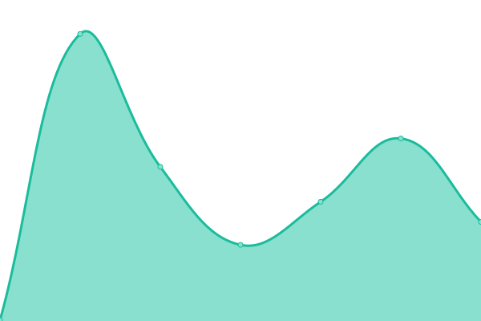 0ms
     
 | 

<a href="https://GiuseppeFilingeri.github.io/upgraded-symmetrical-waddle/history/microsoft">0.00%</a>
    

|  [sina](sina.com.cn) | 🟩 Up | [sina.yml](https://github.com/GiuseppeFilingeri/upgraded-symmetrical-waddle/commits/HEAD/history/sina.yml) | 

 3926ms
     
 | 

<a href="https://GiuseppeFilingeri.github.io/upgraded-symmetrical-waddle/history/sina">56.62%</a>
    

|  [rapidshare](rapidshare.com) | 🟥 Down | [rapidshare.yml](https://github.com/GiuseppeFilingeri/upgraded-symmetrical-waddle/commits/HEAD/history/rapidshare.yml) | 

 0ms
     
 | 

<a href="https://GiuseppeFilingeri.github.io/upgraded-symmetrical-waddle/history/rapidshare">100.00%</a>
    

|  [google](google.fr) | 🟩 Up | [google.yml](https://github.com/GiuseppeFilingeri/upgraded-symmetrical-waddle/commits/HEAD/history/google.yml) | 

 204ms
     
 | 

<a href="https://GiuseppeFilingeri.github.io/upgraded-symmetrical-waddle/history/google">100.00%</a>
    

|  [wordpress](wordpress.com) | 🟩 Up | [wordpress.yml](https://github.com/GiuseppeFilingeri/upgraded-symmetrical-waddle/commits/HEAD/history/wordpress.yml) | 

 66ms
     
 | 

<a href="https://GiuseppeFilingeri.github.io/upgraded-symmetrical-waddle/history/wordpress">100.00%</a>
    

|  [google](google.co.uk) | 🟩 Up | [google.yml](https://github.com/GiuseppeFilingeri/upgraded-symmetrical-waddle/commits/HEAD/history/google.yml) | 

 204ms
     
 | 

<a href="https://GiuseppeFilingeri.github.io/upgraded-symmetrical-waddle/history/google">100.00%</a>
    

|  [google](google.cn) | 🟩 Up | [google.yml](https://github.com/GiuseppeFilingeri/upgraded-symmetrical-waddle/commits/HEAD/history/google.yml) | 

 204ms
     
 | 

<a href="https://GiuseppeFilingeri.github.io/upgraded-symmetrical-waddle/history/google">100.00%</a>
    

|  [craigslist](craigslist.org) | 🟥 Down | [craigslist.yml](https://github.com/GiuseppeFilingeri/upgraded-symmetrical-waddle/commits/HEAD/history/craigslist.yml) | 

 0ms
     
 | 

<a href="https://GiuseppeFilingeri.github.io/upgraded-symmetrical-waddle/history/craigslist">100.00%</a>
    

|  [ebay](ebay.com) | 🟩 Up | [ebay.yml](https://github.com/GiuseppeFilingeri/upgraded-symmetrical-waddle/commits/HEAD/history/ebay.yml) | 

 1077ms
     
 | 

<a href="https://GiuseppeFilingeri.github.io/upgraded-symmetrical-waddle/history/ebay">0.00%</a>
    

|  [fc2](fc2.com) | 🟩 Up | [fc2.yml](https://github.com/GiuseppeFilingeri/upgraded-symmetrical-waddle/commits/HEAD/history/fc2.yml) | 

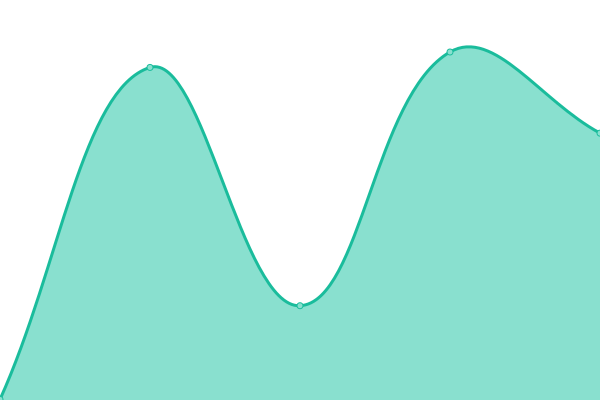 714ms
     
 | 

<a href="https://GiuseppeFilingeri.github.io/upgraded-symmetrical-waddle/history/fc2">100.00%</a>
    

|  [google](google.com.br) | 🟩 Up | [google.yml](https://github.com/GiuseppeFilingeri/upgraded-symmetrical-waddle/commits/HEAD/history/google.yml) | 

 204ms
     
 | 

<a href="https://GiuseppeFilingeri.github.io/upgraded-symmetrical-waddle/history/google">100.00%</a>
    

|  [bing](bing.com) | 🟩 Up | [bing.yml](https://github.com/GiuseppeFilingeri/upgraded-symmetrical-waddle/commits/HEAD/history/bing.yml) | 

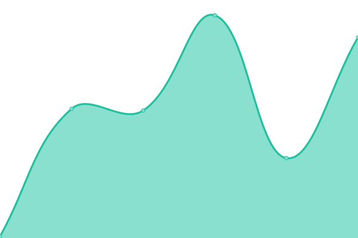 53ms
     
 | 

<a href="https://GiuseppeFilingeri.github.io/upgraded-symmetrical-waddle/history/bing">100.00%</a>
    

|  [yandex](yandex.ru) | 🟩 Up | [yandex.yml](https://github.com/GiuseppeFilingeri/upgraded-symmetrical-waddle/commits/HEAD/history/yandex.yml) | 

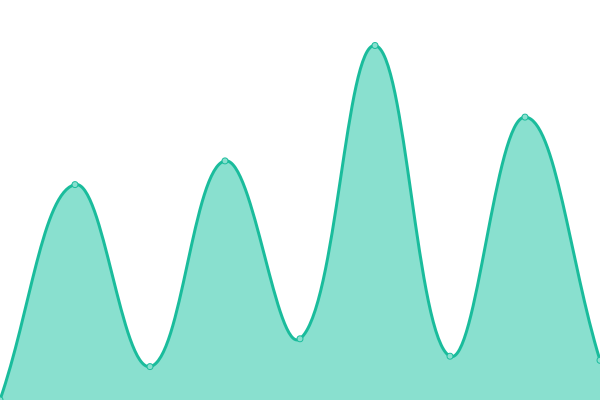 3106ms
     
 | 

<a href="https://GiuseppeFilingeri.github.io/upgraded-symmetrical-waddle/history/yandex">99.86%</a>
    

|  [yandex](yandex.ru) | 🟩 Up | [yandex.yml](https://github.com/GiuseppeFilingeri/upgraded-symmetrical-waddle/commits/HEAD/history/yandex.yml) | 

 3106ms
     
 | 

<a href="https://GiuseppeFilingeri.github.io/upgraded-symmetrical-waddle/history/yandex">99.86%</a>
    

|  [vkontakte](vkontakte.ru) | 🟥 Down | [vkontakte.yml](https://github.com/GiuseppeFilingeri/upgraded-symmetrical-waddle/commits/HEAD/history/vkontakte.yml) | 

 0ms
     
 | 

<a href="https://GiuseppeFilingeri.github.io/upgraded-symmetrical-waddle/history/vkontakte">0.00%</a>
    

|  [mail](mail.ru) | 🟩 Up | [mail.yml](https://github.com/GiuseppeFilingeri/upgraded-symmetrical-waddle/commits/HEAD/history/mail.yml) | 

 2083ms
     
 | 

<a href="https://GiuseppeFilingeri.github.io/upgraded-symmetrical-waddle/history/mail">7.34%</a>
    

|  [google](google.it) | 🟩 Up | [google.yml](https://github.com/GiuseppeFilingeri/upgraded-symmetrical-waddle/commits/HEAD/history/google.yml) | 

 204ms
     
 | 

<a href="https://GiuseppeFilingeri.github.io/upgraded-symmetrical-waddle/history/google">100.00%</a>
    

|  [flickr](flickr.com) | 🟩 Up | [flickr.yml](https://github.com/GiuseppeFilingeri/upgraded-symmetrical-waddle/commits/HEAD/history/flickr.yml) | 

 213ms
     
 | 

<a href="https://GiuseppeFilingeri.github.io/upgraded-symmetrical-waddle/history/flickr">0.00%</a>
    

|  [google](google.co.jp) | 🟩 Up | [google.yml](https://github.com/GiuseppeFilingeri/upgraded-symmetrical-waddle/commits/HEAD/history/google.yml) | 

 204ms
     
 | 

<a href="https://GiuseppeFilingeri.github.io/upgraded-symmetrical-waddle/history/google">100.00%</a>
    

|  [amazon](amazon.com) | 🟩 Up | [amazon.yml](https://github.com/GiuseppeFilingeri/upgraded-symmetrical-waddle/commits/HEAD/history/amazon.yml) | 

 249ms
     
 | 

<a href="https://GiuseppeFilingeri.github.io/upgraded-symmetrical-waddle/history/amazon">0.00%</a>
    

|  [aol](aol.com) | 🟩 Up | [aol.yml](https://github.com/GiuseppeFilingeri/upgraded-symmetrical-waddle/commits/HEAD/history/aol.yml) | 

 478ms
     
 | 

<a href="https://GiuseppeFilingeri.github.io/upgraded-symmetrical-waddle/history/aol">100.00%</a>
    

|  [hi5](hi5.com) | 🟩 Up | [hi5.yml](https://github.com/GiuseppeFilingeri/upgraded-symmetrical-waddle/commits/HEAD/history/hi5.yml) | 

 701ms
     
 | 

<a href="https://GiuseppeFilingeri.github.io/upgraded-symmetrical-waddle/history/hi5">0.00%</a>
    

|  [google](google.es) | 🟩 Up | [google.yml](https://github.com/GiuseppeFilingeri/upgraded-symmetrical-waddle/commits/HEAD/history/google.yml) | 

 204ms
     
 | 

<a href="https://GiuseppeFilingeri.github.io/upgraded-symmetrical-waddle/history/google">100.00%</a>
    

|  [taobao](taobao.com) | 🟩 Up | [taobao.yml](https://github.com/GiuseppeFilingeri/upgraded-symmetrical-waddle/commits/HEAD/history/taobao.yml) | 

 2059ms
     
 | 

<a href="https://GiuseppeFilingeri.github.io/upgraded-symmetrical-waddle/history/taobao">38.11%</a>
    

|  [163](163.com) | 🟩 Up | [163.yml](https://github.com/GiuseppeFilingeri/upgraded-symmetrical-waddle/commits/HEAD/history/163.yml) | 

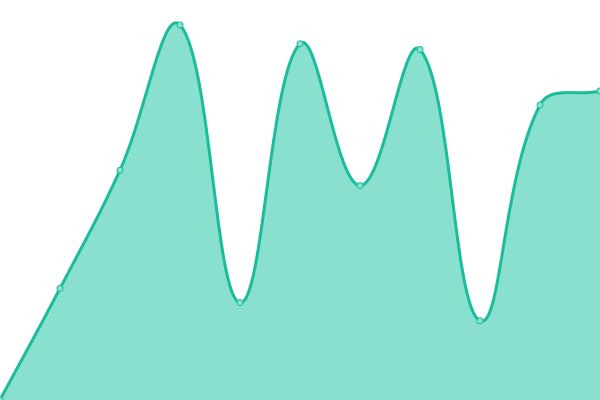 2820ms
     
 | 

<a href="https://GiuseppeFilingeri.github.io/upgraded-symmetrical-waddle/history/163">100.00%</a>
    

|  [bbc](bbc.co.uk) | 🟩 Up | [bbc.yml](https://github.com/GiuseppeFilingeri/upgraded-symmetrical-waddle/commits/HEAD/history/bbc.yml) | 

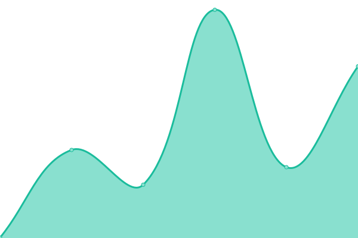 170ms
     
 | 

<a href="https://GiuseppeFilingeri.github.io/upgraded-symmetrical-waddle/history/bbc">100.00%</a>
    

|  [google](google.com.mx) | 🟩 Up | [google.yml](https://github.com/GiuseppeFilingeri/upgraded-symmetrical-waddle/commits/HEAD/history/google.yml) | 

 204ms
     
 | 

<a href="https://GiuseppeFilingeri.github.io/upgraded-symmetrical-waddle/history/google">100.00%</a>
    

|  [orkut](orkut.com.br) | 🟩 Up | [orkut.yml](https://github.com/GiuseppeFilingeri/upgraded-symmetrical-waddle/commits/HEAD/history/orkut.yml) | 

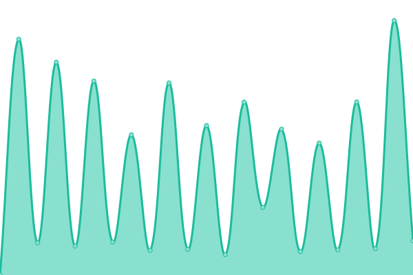 642ms
     
 | 

<a href="https://GiuseppeFilingeri.github.io/upgraded-symmetrical-waddle/history/orkut">100.00%</a>
    

|  [go](go.com) | 🟩 Up | [go.yml](https://github.com/GiuseppeFilingeri/upgraded-symmetrical-waddle/commits/HEAD/history/go.yml) | 

 409ms
     
 | 

<a href="https://GiuseppeFilingeri.github.io/upgraded-symmetrical-waddle/history/go">100.00%</a>
    

|  [youporn](youporn.com) | 🟩 Up | [youporn.yml](https://github.com/GiuseppeFilingeri/upgraded-symmetrical-waddle/commits/HEAD/history/youporn.yml) | 

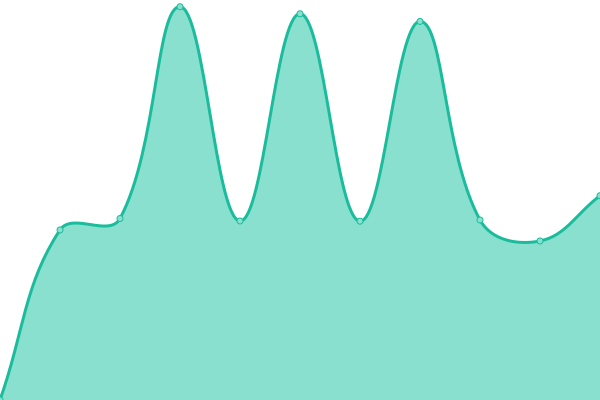 4631ms
     
 | 

<a href="https://GiuseppeFilingeri.github.io/upgraded-symmetrical-waddle/history/youporn">83.61%</a>
    

|  [vmn](vmn.net) | 🟩 Up | [vmn.yml](https://github.com/GiuseppeFilingeri/upgraded-symmetrical-waddle/commits/HEAD/history/vmn.yml) | 

 179ms
     
 | 

<a href="https://GiuseppeFilingeri.github.io/upgraded-symmetrical-waddle/history/vmn">0.00%</a>
    

|  [ask](ask.com) | 🟩 Up | [ask.yml](https://github.com/GiuseppeFilingeri/upgraded-symmetrical-waddle/commits/HEAD/history/ask.yml) | 

 808ms
     
 | 

<a href="https://GiuseppeFilingeri.github.io/upgraded-symmetrical-waddle/history/ask">0.00%</a>
    

|  [pornhub](pornhub.com) | 🟩 Up | [pornhub.yml](https://github.com/GiuseppeFilingeri/upgraded-symmetrical-waddle/commits/HEAD/history/pornhub.yml) | 

 4290ms
     
 | 

<a href="https://GiuseppeFilingeri.github.io/upgraded-symmetrical-waddle/history/pornhub">79.19%</a>
    

|  [Skyrock](Skyrock.com) | 🟩 Up | [skyrock.yml](https://github.com/GiuseppeFilingeri/upgraded-symmetrical-waddle/commits/HEAD/history/skyrock.yml) | 

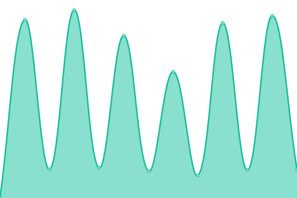 295ms
     
 | 

<a href="https://GiuseppeFilingeri.github.io/upgraded-symmetrical-waddle/history/skyrock">100.00%</a>
    

|  [skyrock](skyrock.com) | 🟩 Up | [skyrock.yml](https://github.com/GiuseppeFilingeri/upgraded-symmetrical-waddle/commits/HEAD/history/skyrock.yml) | 

 295ms
     
 | 

<a href="https://GiuseppeFilingeri.github.io/upgraded-symmetrical-waddle/history/skyrock">100.00%</a>
    

|  [sohu](sohu.com) | 🟩 Up | [sohu.yml](https://github.com/GiuseppeFilingeri/upgraded-symmetrical-waddle/commits/HEAD/history/sohu.yml) | 

 1459ms
     
 | 

<a href="https://GiuseppeFilingeri.github.io/upgraded-symmetrical-waddle/history/sohu">50.32%</a>
    

|  [conduit](conduit.com) | 🟥 Down | [conduit.yml](https://github.com/GiuseppeFilingeri/upgraded-symmetrical-waddle/commits/HEAD/history/conduit.yml) | 

 0ms
     
 | 

<a href="https://GiuseppeFilingeri.github.io/upgraded-symmetrical-waddle/history/conduit">100.00%</a>
    

|  [adobe](adobe.com) | 🟥 Down | [adobe.yml](https://github.com/GiuseppeFilingeri/upgraded-symmetrical-waddle/commits/HEAD/history/adobe.yml) | 

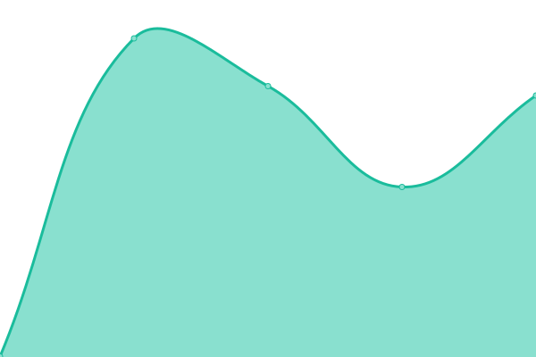 0ms
     
 | 

<a href="https://GiuseppeFilingeri.github.io/upgraded-symmetrical-waddle/history/adobe">0.00%</a>
    

|  [apple](apple.com) | 🟩 Up | [apple.yml](https://github.com/GiuseppeFilingeri/upgraded-symmetrical-waddle/commits/HEAD/history/apple.yml) | 

 174ms
     
 | 

<a href="https://GiuseppeFilingeri.github.io/upgraded-symmetrical-waddle/history/apple">100.00%</a>
    

|  [google](google.ca) | 🟩 Up | [google.yml](https://github.com/GiuseppeFilingeri/upgraded-symmetrical-waddle/commits/HEAD/history/google.yml) | 

 204ms
     
 | 

<a href="https://GiuseppeFilingeri.github.io/upgraded-symmetrical-waddle/history/google">100.00%</a>
    

|  [cnn](cnn.com) | 🟩 Up | [cnn.yml](https://github.com/GiuseppeFilingeri/upgraded-symmetrical-waddle/commits/HEAD/history/cnn.yml) | 

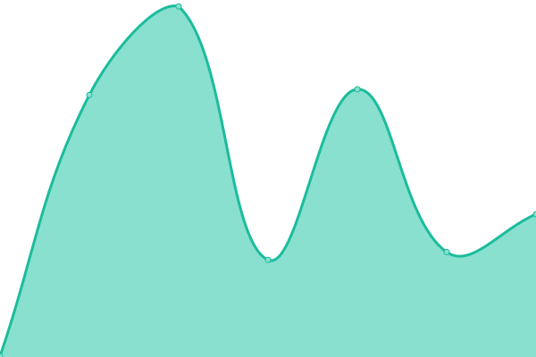 133ms
     
 | 

<a href="https://GiuseppeFilingeri.github.io/upgraded-symmetrical-waddle/history/cnn">100.00%</a>
    

|  [megaupload](megaupload.com) | 🟥 Down | [megaupload.yml](https://github.com/GiuseppeFilingeri/upgraded-symmetrical-waddle/commits/HEAD/history/megaupload.yml) | 

 0ms
     
 | 

<a href="https://GiuseppeFilingeri.github.io/upgraded-symmetrical-waddle/history/megaupload">100.00%</a>
    

|  [orkut](orkut.co.in) | 🟩 Up | [orkut.yml](https://github.com/GiuseppeFilingeri/upgraded-symmetrical-waddle/commits/HEAD/history/orkut.yml) | 

 642ms
     
 | 

<a href="https://GiuseppeFilingeri.github.io/upgraded-symmetrical-waddle/history/orkut">100.00%</a>
    

|  [imageshack](imageshack.us) | 🟩 Up | [imageshack.yml](https://github.com/GiuseppeFilingeri/upgraded-symmetrical-waddle/commits/HEAD/history/imageshack.yml) | 

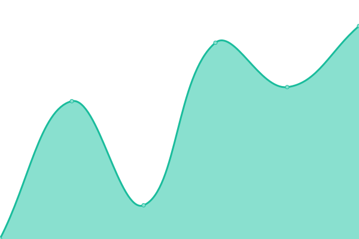 602ms
     
 | 

<a href="https://GiuseppeFilingeri.github.io/upgraded-symmetrical-waddle/history/imageshack">19.26%</a>
    

|  [uol](uol.com.br) | 🟩 Up | [uol.yml](https://github.com/GiuseppeFilingeri/upgraded-symmetrical-waddle/commits/HEAD/history/uol.yml) | 

 2003ms
     
 | 

<a href="https://GiuseppeFilingeri.github.io/upgraded-symmetrical-waddle/history/uol">69.62%</a>
    

|  [google](google.com.tr) | 🟩 Up | [google.yml](https://github.com/GiuseppeFilingeri/upgraded-symmetrical-waddle/commits/HEAD/history/google.yml) | 

 204ms
     
 | 

<a href="https://GiuseppeFilingeri.github.io/upgraded-symmetrical-waddle/history/google">100.00%</a>
    

|  [youku](youku.com) | 🟩 Up | [youku.yml](https://github.com/GiuseppeFilingeri/upgraded-symmetrical-waddle/commits/HEAD/history/youku.yml) | 

 7267ms
     
 | 

<a href="https://GiuseppeFilingeri.github.io/upgraded-symmetrical-waddle/history/youku">0.95%</a>
    

|  [rakuten](rakuten.co.jp) | 🟩 Up | [rakuten.yml](https://github.com/GiuseppeFilingeri/upgraded-symmetrical-waddle/commits/HEAD/history/rakuten.yml) | 

 1323ms
     
 | 

<a href="https://GiuseppeFilingeri.github.io/upgraded-symmetrical-waddle/history/rakuten">62.39%</a>
    

|  [redtube](redtube.com) | 🟩 Up | [redtube.yml](https://github.com/GiuseppeFilingeri/upgraded-symmetrical-waddle/commits/HEAD/history/redtube.yml) | 

 2825ms
     
 | 

<a href="https://GiuseppeFilingeri.github.io/upgraded-symmetrical-waddle/history/redtube">0.00%</a>
    

|  [ebay](ebay.de) | 🟩 Up | [ebay.yml](https://github.com/GiuseppeFilingeri/upgraded-symmetrical-waddle/commits/HEAD/history/ebay.yml) | 

 1077ms
     
 | 

<a href="https://GiuseppeFilingeri.github.io/upgraded-symmetrical-waddle/history/ebay">0.00%</a>
    

|  [livejasmin](livejasmin.com) | 🟩 Up | [livejasmin.yml](https://github.com/GiuseppeFilingeri/upgraded-symmetrical-waddle/commits/HEAD/history/livejasmin.yml) | 

 1299ms
     
 | 

<a href="https://GiuseppeFilingeri.github.io/upgraded-symmetrical-waddle/history/livejasmin">100.00%</a>
    

|  [cnet](cnet.com) | 🟩 Up | [cnet.yml](https://github.com/GiuseppeFilingeri/upgraded-symmetrical-waddle/commits/HEAD/history/cnet.yml) | 

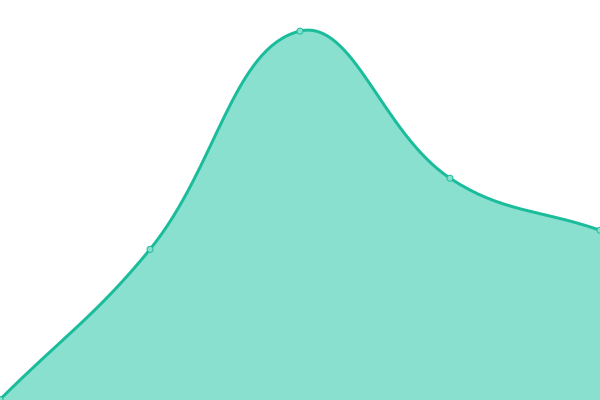 202ms
     
 | 

<a href="https://GiuseppeFilingeri.github.io/upgraded-symmetrical-waddle/history/cnet">100.00%</a>
    

|  [tube8](tube8.com) | 🟩 Up | [tube8.yml](https://github.com/GiuseppeFilingeri/upgraded-symmetrical-waddle/commits/HEAD/history/tube8.yml) | 

 2066ms
     
 | 

<a href="https://GiuseppeFilingeri.github.io/upgraded-symmetrical-waddle/history/tube8">100.00%</a>
    

|  [ameblo](ameblo.jp) | 🟩 Up | [ameblo.yml](https://github.com/GiuseppeFilingeri/upgraded-symmetrical-waddle/commits/HEAD/history/ameblo.yml) | 

 845ms
     
 | 

<a href="https://GiuseppeFilingeri.github.io/upgraded-symmetrical-waddle/history/ameblo">100.00%</a>
    

|  [rediff](rediff.com) | 🟩 Up | [rediff.yml](https://github.com/GiuseppeFilingeri/upgraded-symmetrical-waddle/commits/HEAD/history/rediff.yml) | 

 393ms
     
 | 

<a href="https://GiuseppeFilingeri.github.io/upgraded-symmetrical-waddle/history/rediff">100.00%</a>
    

|  [about](about.com) | 🟩 Up | [about.yml](https://github.com/GiuseppeFilingeri/upgraded-symmetrical-waddle/commits/HEAD/history/about.yml) | 

 215ms
     
 | 

<a href="https://GiuseppeFilingeri.github.io/upgraded-symmetrical-waddle/history/about">100.00%</a>
    

|  [soso](soso.com) | 🟩 Up | [soso.yml](https://github.com/GiuseppeFilingeri/upgraded-symmetrical-waddle/commits/HEAD/history/soso.yml) | 

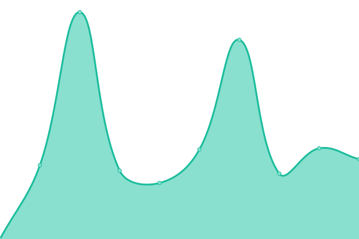 2416ms
     
 | 

<a href="https://GiuseppeFilingeri.github.io/upgraded-symmetrical-waddle/history/soso">100.00%</a>
    

|  [google](google.co.id) | 🟩 Up | [google.yml](https://github.com/GiuseppeFilingeri/upgraded-symmetrical-waddle/commits/HEAD/history/google.yml) | 

 204ms
     
 | 

<a href="https://GiuseppeFilingeri.github.io/upgraded-symmetrical-waddle/history/google">100.00%</a>
    

|  [livedoor](livedoor.com) | 🟩 Up | [livedoor.yml](https://github.com/GiuseppeFilingeri/upgraded-symmetrical-waddle/commits/HEAD/history/livedoor.yml) | 

 1231ms
     
 | 

<a href="https://GiuseppeFilingeri.github.io/upgraded-symmetrical-waddle/history/livedoor">100.00%</a>
    

<!--end: status pages-->

[**Visit our status website →**](https://GiuseppeFilingeri.github.io/upgraded-symmetrical-waddle)

## 📄 License

- Powered by: [Waddle](https://giuseppefilingeri.github.io/upgraded-symmetrical-waddle)
- Code: [MIT](./LICENSE) © [GiuseppeFilingeri](https://giuseppefilingeri.github.io/upgraded-symmetrical-waddle)
- Data in the `./history` directory: [Open Database License](https://opendatacommons.org/licenses/odbl/1-0/)
