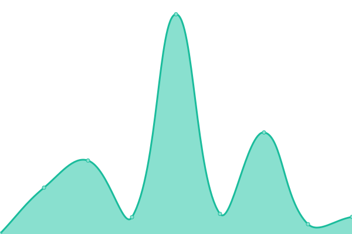

# [📈 Live Status](https://GiuseppeFilingeri.github.io/upgraded-symmetrical-waddle): <!--live status--> **🟩 All systems operational**

This repository contains the open-source uptime monitor and status page for [GiuseppeFilingeri](https://GiuseppeFilingeri.github.io/upgraded-symmetrical-waddle), powered by [Upptime](https://github.com/upptime/upptime).

With [Upptime](https://upptime.js.org), you can get your own unlimited and free uptime monitor and status page, powered entirely by a GitHub repository. We use [Issues](https://github.com/GiuseppeFilingeri/upgraded-symmetrical-waddle/issues) as incident reports, [Actions](https://github.com/GiuseppeFilingeri/upgraded-symmetrical-waddle/actions) as uptime monitors, and [Pages](https://GiuseppeFilingeri.github.io/upgraded-symmetrical-waddle) for the status page.

<!--start: status pages-->
<!-- This summary is generated by Upptime (https://github.com/upptime/upptime) -->
<!-- Do not edit this manually, your changes will be overwritten -->
<!-- prettier-ignore -->
| URL | Status | History | Response Time | Uptime |
| --- | ------ | ------- | ------------- | ------ |
|  [Google](https://www.google.com) | 🟩 Up | [google.yml](https://github.com/GiuseppeFilingeri/upgraded-symmetrical-waddle/commits/HEAD/history/google.yml) | 

 95ms
     
 | 

<a href="https://GiuseppeFilingeri.github.io/upgraded-symmetrical-waddle/history/google">100.00%</a>
    

|  [Wikipedia](https://en.wikipedia.org) | 🟩 Up | [wikipedia.yml](https://github.com/GiuseppeFilingeri/upgraded-symmetrical-waddle/commits/HEAD/history/wikipedia.yml) | 

 147ms
     
 | 

<a href="https://GiuseppeFilingeri.github.io/upgraded-symmetrical-waddle/history/wikipedia">100.00%</a>
    

|  [Disdicilo](https://www.disdicilo.it) | 🟩 Up | [disdicilo.yml](https://github.com/GiuseppeFilingeri/upgraded-symmetrical-waddle/commits/HEAD/history/disdicilo.yml) | 

 706ms
     
 | 

<a href="https://GiuseppeFilingeri.github.io/upgraded-symmetrical-waddle/history/disdicilo">100.00%</a>
    

|  [Mangahype](https://www.mangahype.org) | 🟩 Up | [mangahype.yml](https://github.com/GiuseppeFilingeri/upgraded-symmetrical-waddle/commits/HEAD/history/mangahype.yml) | 

 577ms
     
 | 

<a href="https://GiuseppeFilingeri.github.io/upgraded-symmetrical-waddle/history/mangahype">100.00%</a>
    

|  [DuckDuckGo](https://duckduckgo.com) | 🟩 Up | [duck-duck-go.yml](https://github.com/GiuseppeFilingeri/upgraded-symmetrical-waddle/commits/HEAD/history/duck-duck-go.yml) | 

 64ms
     
 | 

<a href="https://GiuseppeFilingeri.github.io/upgraded-symmetrical-waddle/history/duck-duck-go">100.00%</a>
    

<!--end: status pages-->

[**Visit our status website →**](https://GiuseppeFilingeri.github.io/upgraded-symmetrical-waddle)

## 📄 License

- Powered by: [Upptime](https://github.com/upptime/upptime)
- Code: [MIT](./LICENSE) © [GiuseppeFilingeri](https://GiuseppeFilingeri.github.io/upgraded-symmetrical-waddle)
- Data in the `./history` directory: [Open Database License](https://opendatacommons.org/licenses/odbl/1-0/)
