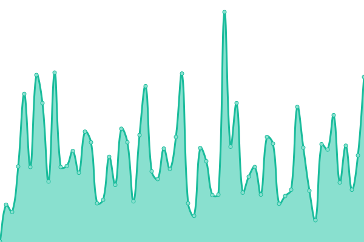

# [📈 Live Status](https://GiuseppeFilingeri.github.io/upgraded-symmetrical-waddle): <!--live status--> **🟧 Partial outage**

With [Upptime](https://upptime.js.org), you can get your own unlimited and free uptime monitor and status page, powered entirely by a GitHub repository. We use [Issues](https://github.com/GiuseppeFilingeri/upgraded-symmetrical-waddle/issues) as incident reports, [Actions](https://github.com/GiuseppeFilingeri/upgraded-symmetrical-waddle/actions) as uptime monitors, and [Pages](https://GiuseppeFilingeri.github.io/upgraded-symmetrical-waddle) for the status page.

<!--start: status pages-->
<!-- This summary is generated by Upptime (https://github.com/upptime/upptime) -->
<!-- Do not edit this manually, your changes will be overwritten -->
<!-- prettier-ignore -->
| URL | Status | History | Response Time | Uptime |
| --- | ------ | ------- | ------------- | ------ |
|  [Google](https://www.google.com) | 🟩 Up | [google.yml](https://github.com/GiuseppeFilingeri/upgraded-symmetrical-waddle/commits/HEAD/history/google.yml) | 

 94ms
     
 | 

<a href="https://GiuseppeFilingeri.github.io/upgraded-symmetrical-waddle/history/google">100.00%</a>
    

|  [Wikipedia](https://en.wikipedia.org) | 🟩 Up | [wikipedia.yml](https://github.com/GiuseppeFilingeri/upgraded-symmetrical-waddle/commits/HEAD/history/wikipedia.yml) | 

 160ms
     
 | 

<a href="https://GiuseppeFilingeri.github.io/upgraded-symmetrical-waddle/history/wikipedia">100.00%</a>
    

|  [Disdicilo](https://www.disdicilo.it) | 🟩 Up | [disdicilo.yml](https://github.com/GiuseppeFilingeri/upgraded-symmetrical-waddle/commits/HEAD/history/disdicilo.yml) | 

 475ms
     
 | 

<a href="https://GiuseppeFilingeri.github.io/upgraded-symmetrical-waddle/history/disdicilo">100.00%</a>
    

|  [Mangahype](https://www.mangahype.org) | 🟩 Up | [mangahype.yml](https://github.com/GiuseppeFilingeri/upgraded-symmetrical-waddle/commits/HEAD/history/mangahype.yml) | 

 436ms
     
 | 

<a href="https://GiuseppeFilingeri.github.io/upgraded-symmetrical-waddle/history/mangahype">100.00%</a>
    

|  [DuckDuckGo](https://duckduckgo.com) | 🟩 Up | [duck-duck-go.yml](https://github.com/GiuseppeFilingeri/upgraded-symmetrical-waddle/commits/HEAD/history/duck-duck-go.yml) | 

 60ms
     
 | 

<a href="https://GiuseppeFilingeri.github.io/upgraded-symmetrical-waddle/history/duck-duck-go">100.00%</a>
    

|  [symmetrical waddle](https://giuseppefilingeri.github.io/upgraded-symmetrical-waddle) | 🟩 Up | [symmetrical-waddle.yml](https://github.com/GiuseppeFilingeri/upgraded-symmetrical-waddle/commits/HEAD/history/symmetrical-waddle.yml) | 

 90ms
     
 | 

<a href="https://GiuseppeFilingeri.github.io/upgraded-symmetrical-waddle/history/symmetrical-waddle">100.00%</a>
    

|  [ziggys-bar](ziggys-bar.com) | 🟥 Down | [ziggys-bar.yml](https://github.com/GiuseppeFilingeri/upgraded-symmetrical-waddle/commits/HEAD/history/ziggys-bar.yml) | 

 0ms
     
 | 

<a href="https://GiuseppeFilingeri.github.io/upgraded-symmetrical-waddle/history/ziggys-bar">0.49%</a>
    

|  [nedis](nedis.nl) | 🟩 Up | [nedis.yml](https://github.com/GiuseppeFilingeri/upgraded-symmetrical-waddle/commits/HEAD/history/nedis.yml) | 

 1525ms
     
 | 

<a href="https://GiuseppeFilingeri.github.io/upgraded-symmetrical-waddle/history/nedis">100.00%</a>
    

|  [websearch](websearch.com) | 🟥 Down | [websearch.yml](https://github.com/GiuseppeFilingeri/upgraded-symmetrical-waddle/commits/HEAD/history/websearch.yml) | 

 119ms
     
 | 

<a href="https://GiuseppeFilingeri.github.io/upgraded-symmetrical-waddle/history/websearch">2.00%</a>
    

|  [iranrapfa](iranrapfa.com) | 🟥 Down | [iranrapfa.yml](https://github.com/GiuseppeFilingeri/upgraded-symmetrical-waddle/commits/HEAD/history/iranrapfa.yml) | 

 0ms
     
 | 

<a href="https://GiuseppeFilingeri.github.io/upgraded-symmetrical-waddle/history/iranrapfa">0.00%</a>
    

|  [allekabels](allekabels.nl) | 🟥 Down | [allekabels.yml](https://github.com/GiuseppeFilingeri/upgraded-symmetrical-waddle/commits/HEAD/history/allekabels.yml) | 

 825ms
     
 | 

<a href="https://GiuseppeFilingeri.github.io/upgraded-symmetrical-waddle/history/allekabels">1.85%</a>
    

|  [kabeltje](kabeltje.com) | 🟩 Up | [kabeltje.yml](https://github.com/GiuseppeFilingeri/upgraded-symmetrical-waddle/commits/HEAD/history/kabeltje.yml) | 

 2731ms
     
 | 

<a href="https://GiuseppeFilingeri.github.io/upgraded-symmetrical-waddle/history/kabeltje">100.00%</a>
    

|  [cocinasana](cocinasana.net) | 🟩 Up | [cocinasana.yml](https://github.com/GiuseppeFilingeri/upgraded-symmetrical-waddle/commits/HEAD/history/cocinasana.yml) | 

 249ms
     
 | 

<a href="https://GiuseppeFilingeri.github.io/upgraded-symmetrical-waddle/history/cocinasana">100.00%</a>
    

|  [bitfan](bitfan.com) | 🟩 Up | [bitfan.yml](https://github.com/GiuseppeFilingeri/upgraded-symmetrical-waddle/commits/HEAD/history/bitfan.yml) | 

 333ms
     
 | 

<a href="https://GiuseppeFilingeri.github.io/upgraded-symmetrical-waddle/history/bitfan">100.00%</a>
    

|  [xxlhd](xxlhd.com) | 🟩 Up | [xxlhd.yml](https://github.com/GiuseppeFilingeri/upgraded-symmetrical-waddle/commits/HEAD/history/xxlhd.yml) | 

 116ms
     
 | 

<a href="https://GiuseppeFilingeri.github.io/upgraded-symmetrical-waddle/history/xxlhd">100.00%</a>
    

|  [megachicks](megachicks.ru) | 🟥 Down | [megachicks.yml](https://github.com/GiuseppeFilingeri/upgraded-symmetrical-waddle/commits/HEAD/history/megachicks.yml) | 

 0ms
     
 | 

<a href="https://GiuseppeFilingeri.github.io/upgraded-symmetrical-waddle/history/megachicks">0.00%</a>
    

|  [riphone](riphone.ru) | 🟥 Down | [riphone.yml](https://github.com/GiuseppeFilingeri/upgraded-symmetrical-waddle/commits/HEAD/history/riphone.yml) | 

 0ms
     
 | 

<a href="https://GiuseppeFilingeri.github.io/upgraded-symmetrical-waddle/history/riphone">0.74%</a>
    

|  [riphone](riphone.ru) | 🟥 Down | [riphone.yml](https://github.com/GiuseppeFilingeri/upgraded-symmetrical-waddle/commits/HEAD/history/riphone.yml) | 

 0ms
     
 | 

<a href="https://GiuseppeFilingeri.github.io/upgraded-symmetrical-waddle/history/riphone">1.58%</a>
    

|  [twoc](twoc.co.uk) | 🟩 Up | [twoc.yml](https://github.com/GiuseppeFilingeri/upgraded-symmetrical-waddle/commits/HEAD/history/twoc.yml) | 

 338ms
     
 | 

<a href="https://GiuseppeFilingeri.github.io/upgraded-symmetrical-waddle/history/twoc">100.00%</a>
    

|  [btinternet](btinternet.com) | 🟥 Down | [btinternet.yml](https://github.com/GiuseppeFilingeri/upgraded-symmetrical-waddle/commits/HEAD/history/btinternet.yml) | 

 0ms
     
 | 

<a href="https://GiuseppeFilingeri.github.io/upgraded-symmetrical-waddle/history/btinternet">71.01%</a>
    

<!--end: status pages-->

[**Visit our status website →**](https://GiuseppeFilingeri.github.io/upgraded-symmetrical-waddle)

## 📄 License

- Powered by: [Waddle](https://giuseppefilingeri.github.io/upgraded-symmetrical-waddle)
- Code: [MIT](./LICENSE) © [GiuseppeFilingeri](https://giuseppefilingeri.github.io/upgraded-symmetrical-waddle)
- Data in the `./history` directory: [Open Database License](https://opendatacommons.org/licenses/odbl/1-0/)
